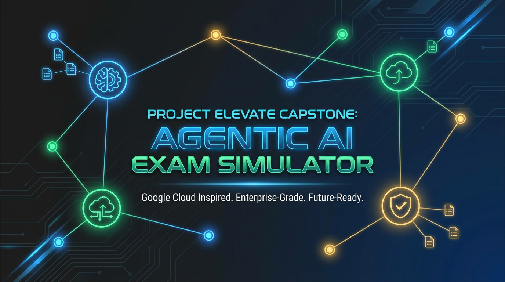
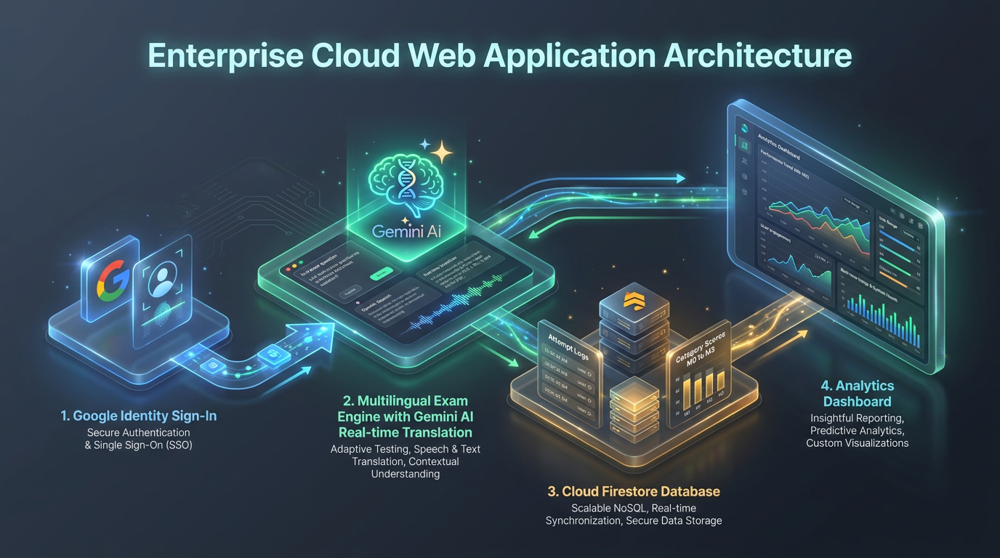
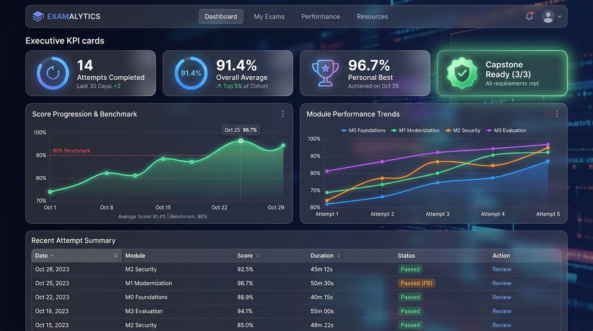
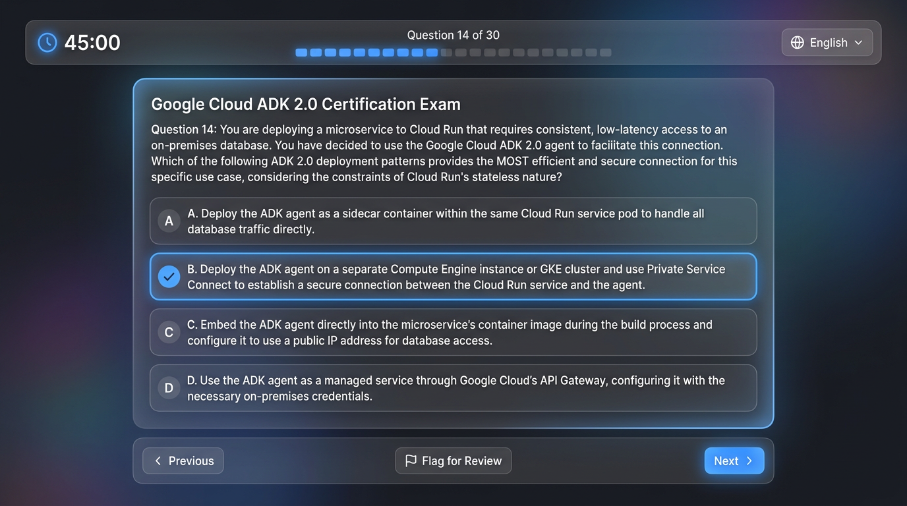

# Project Elevate Capstone: Agentic AI Exam Simulator & Analytics Platform

<p align="center">
  
</p>

<p align="center">
  
  
  
  
  
</p>

---

## 🌟 Executive Overview

**Project Elevate Capstone Exam Simulator** is a high-performance web platform designed specifically for **Google Cloud Customer Engineers (CEs)** preparing for the mandatory **Project Elevate Capstone Accreditation (GRAD 2026 `KS1`)**.

The official accreditation requires achieving a **minimum 90% score (27 out of 30 correct answers)** on a rigorous **HackerRank knowledge assessment** covering production Agentic AI architectures, **ADK 2.0**, **Gemini Enterprise Agent Platform (GEAP)**, **MCP/A2A protocols**, **Model Armor**, and **machine-speed security**.

This application provides an authentic, high-fidelity exam simulation environment backed by **Google Identity authentication**, a **dynamic Cloud Storage question corpus (supporting daily auto-sync and on-demand reload)**, **Cloud Firestore historical persistence**, **real-time multilingual translation via Gemini**, and a **personalized performance evolution dashboard** that tracks mastery across all four canonical exam modules over time.

---

## 🏗️ System Architecture

The application is structured around five tightly coupled, production-ready pillars:

<p align="center">
  
</p>

### 1. Mandatory Entry Portal Gatekeeper & Google Single Sign-On (SSO)
- **Zero Unauthenticated Access**: Unauthenticated visitors are locked strictly to a dedicated **Landing Entry Portal** (`LoginGateway`). No exam questions, study materials, or dashboards can be accessed without signing in.
- **Google Identity Single Sign-On**: Seamless authentication using **Google Identity Services (GIS)** and **Firebase Auth** with `GoogleAuthProvider`.
- Captures candidate identity (`uid`, `email`, `displayName`, `photoURL`) with persistent local sessions to isolate database records per user.

### 2. Dynamic Cloud Storage Bucket Question Repository (`gs://...`)
- The question bank is stored in a **Google Cloud Storage (GCS) bucket** (`gs://elevate-capstone-testprep-questions/questions.json`), completely decoupled from the container lifecycle.
- **Future-Stage Flexibility**: Questions can be edited, refreshed, or expanded at any future stage without code changes or redeploying the web application.
- **Dual Ingestion & Synchronization Strategy**:
  - **Daily Automatic Background Refresh**: The application automatically checks and syncs questions from the bucket **once a day (24-hour TTL)** in the background.
  - **On-Demand Manual Reload Trigger**: Users and administrators can click **"Sync Questions"** at any time to immediately force a reload of the latest questions from the bucket.
  - **Resilient Fallback**: Bundled fallback ensures the application remains 100% operational even offline or during initial local setup.

### 3. Semantic Markdown-to-HTML Question Engine & Dynamic Translation
- **Semantic Markdown Parsing**: Question stems, options, and slide reference explanations are converted dynamically into styled HTML (`<strong>`, `<em>`, `<code>`, `<ul>`, `<li>`), eliminating raw markdown asterisks (`*`) and backticks.
- **Pre-Render Translation via Gemini**: Zero-latency native English practice, plus **dynamic on-the-fly translation** into Spanish, Portuguese, French, German, Italian, Japanese, Korean, or custom languages.
- **Translate-Before-Render guarantee**: Questions and options never flicker in English while translating; Gemini generates structured output batches, persists them to local cache, and renders cleanly before the 45-minute countdown timer begins.
- Strict preservation of official Google Cloud and Elevate technical terminology (e.g., `Agent Runtime`, `Agent Registry`, `ADK`, `MCP`, `A2A`, `Model Armor`, `CodeMender`).

### 4. Cloud Firestore Historical Persistence & Zero-Mock Guarantee
- **Immutable Historical Records**: Each completed exam simulation is persisted directly into Cloud Firestore (`exam_attempts/{attemptId}`).
- **Strict Real Data**: No mock or fictitious progressions are ever seeded. The database records genuine user performance.
- Logs elapsed time, selected language, exam mode, **overall score percentage**, and **category breakdowns** for all 4 modules (M0, M1, M2, M3).
- Stores full question-level audit trails (`userSelected`, `correctOptions`, `isCorrect`) for post-exam review.

### 5. Interactive Time-Series Evolution Dashboard & Baseline State
- Personal analytics portal (`/dashboard`) visualizing candidate progression over time.
- **First-Time Candidate Baseline**: Displays a clean, motivating empty state for new candidates (0 attempts, `--` average, "Baseline Required") until their first real exam attempt is recorded.
- Compares learning curves directly against the **official 90% HackerRank benchmark**.
- Detects knowledge gaps automatically across M0, M1, M2, and M3 to recommend focused study modules.

---

## 🪣 Dynamic Question Ingestion & Cloud Storage Synchronization

To accommodate future evolution of the Project Elevate curriculum, questions are managed outside the application binary:

```
+-------------------------------------------------------------+
|        Google Cloud Storage (GCS) Bucket Repository         |
|   gs://elevate-capstone-testprep-questions/questions.json   |
+-------------------------------------------------------------+
               ▲                                ▲
               │ (1) Daily Auto-Sync (24h)      │ (2) On-Demand Force Reload
               ▼                                ▼
+-------------------------------------------------------------+
|              questionBankService (Client / API)             |
|   • In-Memory Store   • Local Storage Cache   • Schema Check|
+-------------------------------------------------------------+
               │
               ▼
+-------------------------------------------------------------+
|                 Exam Simulator & Dashboard                  |
+-------------------------------------------------------------+
```

1. **Daily Scheduled Check**: The service checks `elevate_questions_last_sync`. If 24 hours have passed, it performs an HTTP conditional fetch (`If-None-Match: <ETag>`) against the Cloud Storage bucket to download updates transparently.
2. **On-Demand UI Trigger**: An interactive **"Sync Questions"** button in the header/dashboard triggers an immediate fetch with cache-busting, instantly reflecting any new questions or updated explanations uploaded to the bucket.
3. **Graceful Fallback**: If the bucket is unreachable, the system seamlessly falls back to the embedded canonical corpus, guaranteeing zero downtime.

---

## 📊 Analytics & Time-Series Evolution Dashboard

<p align="center">
  
</p>

The dashboard gives candidates clear, actionable feedback on their readiness for the Capstone:

- **Executive KPI Cards**: Instant visibility into total simulations completed, cumulative practice hours, weighted overall average, personal best score, and the **"Capstone Readiness Index"** (🟢 *Exam Ready* when the last 3 simulations achieve $\ge 90\%$).
- **Overall Score Progression vs. 90% Benchmark**: A continuous time-series line chart tracking overall score percentage against the dashed red **90% accreditation threshold line**.
- **Category-Level Evolution Over Time (M0–M3)**: A multi-line chart tracking individual trajectories for each of the 4 exam modules:
  - 🔵 **M0: Agentic AI Foundations & ADK**
  - 🟢 **M1: Cloud Modernization & MCP**
  - 🟠 **M2: Machine-Speed Security & Governance**
  - 🟣 **M3: Evaluation, Data & Observability/Cost**
- **Automated Gap Diagnostic & Remediation**: Automatically flags the candidate's weakest category and offers a one-click shortcut to launch focused practice in that module.
- **Full Historical Audit Table**: Chronological log of past attempts with category mini-progress bars and an interactive **"Review Exam"** modal that reveals official slide explanations for every question.

---

## 📝 Authentic Exam Simulator Experience

<p align="center">
  
</p>

The simulator replicates the exact constraints and cognitive demands of the official HackerRank Capstone test:

- **Strict 45-Minute Countdown**: Official timing simulation with visual alerts at 10 minutes and 2 minutes remaining.
- **Proportional 80/20 Question Distribution**:
  - **Single-Choice Questions (80%)**: Clean radio button controls selecting 1 of 4 options (`A, B, C, D`).
  - **Multi-Response Questions (20%)**: Checkbox controls requiring candidates to select exactly 2 or 3 correct options (e.g., `Select exactly 2 options`).
- **Strict Capstone Scoring (No Partial Credit)**: Multi-response questions award 1 point **only if the chosen set matches the answer key exactly**, mirroring HackerRank's grading policy.
- **Exam Modes**:
  1. **Official Capstone Simulation**: 30 questions randomly drawn according to module weights (9 M0, 7 M1, 7 M2, 7 M3).
  2. **Fixed Mock Exams (Mocks 1 to 5)**: 5 non-overlapping 30-question sets covering 100% of the syllabus.
  3. **Marathon Mode**: 150 questions sequentially with progress auto-save.
  4. **Module Study Mode**: Targeted practice with immediate explanation feedback.

---

## 📚 Canonical Question Corpus & Module Structure

The initial question bank is maintained in [`questions.md`](questions.md) as the authoritative Single Source of Truth, pre-compiled into `questions.json` for Cloud Storage deployment:

| Module | Code | Title | Scope & Topics | Questions | Weight (30Q Exam) |
| :---: | :---: | :--- | :--- | :---: | :---: |
| **0** | **M0** | **Agentic AI Foundations & ADK** | Core Purpose, Agent Runtime, Agent Definition, MCP vs. Extensions, Antigravity 2.0 vs. Jetski, Argolis | `Q001`–`Q045` (45 Qs) | **9 Questions (30%)** |
| **1** | **M1** | **Cloud Modernization, Context Engineering & MCP** | AWS to GCP Migration, Context Rot, PR Slop, MCP Toolbox, Enterprise Grounding, Vector DBs | `Q046`–`Q080` (35 Qs) | **7 Questions (23.3%)** |
| **2** | **M2** | **Machine-Speed Security & Agent Governance** | CodeMender, Wiz integration, Agent Identity (SPIFFE/mTLS), Agent Gateway, Model Armor, Least Privilege | `Q081`–`Q115` (35 Qs) | **7 Questions (23.3%)** |
| **3** | **M3** | **ADK 2.0, GEAP Evaluation, Harness Engineering & Cost** | Golden Datasets, GEAP Evaluators, Harness Engineering, OpenTelemetry Tracing, FinOps, Cost Controls | `Q116`–`Q150` (35 Qs) | **7 Questions (23.3%)** |

### Verified Mathematical Equiprobability
Every option letter (`A`, `B`, `C`, `D`) has been mathematically balanced across all 150 questions:
- **Single-Choice (120 Qs)**: Exactly **30 `A` (25.0%)**, **30 `B` (25.0%)**, **30 `C` (25.0%)**, **30 `D` (25.0%)**.
- **Multi-Response (30 Qs / 80 slots)**: Exactly **20 `A` (25.0%)**, **20 `B` (25.0%)**, **20 `C` (25.0%)**, **20 `D` (25.0%)**.
- **Global Grand Total (200 correct slots)**: Exactly **50 `A` (25.0%)**, **50 `B` (25.0%)**, **50 `C` (25.0%)**, **50 `D` (25.0%)**.

---

## 📂 Project Repository Structure

```
.
├── README.md                 # Graphical executive project documentation
├── spec.md                   # Complete functional, data & technical specification
├── questions.md              # Canonical English question corpus (150 Qs Single Source of Truth)
├── assets/
│   └── images/               # High-resolution architectural and UI visual assets
│       ├── hero_banner.png
│       ├── architecture_diagram.png
│       ├── dashboard_preview.png
│       └── exam_simulator_ui.png
└── dontUse.txt               # Deployment and cloud configuration notes
```

---

## 🚀 Key Specification References

For in-depth implementation guidance, data schemas, and service interfaces, refer to:
- [`spec.md`](spec.md) — Comprehensive Antigravity build guide:
  - `Section 2.1`: Google Identity authentication setup and session context.
  - `Section 2.2`: Cloud Firestore schema, TypeScript interfaces (`types/examHistory.ts`), and history service (`examHistoryService.ts`).
  - `Section 2.3`: Recharts time-series chart specifications and dashboard components.
  - `Section 2.4 & 2.5`: Gemini translation pipeline implementation (`geminiTranslator.ts`) and system prompts.
  - `Section 2.7`: Mathematical scoring formulas and UI validation rules.
  - `Section 2.8`: Cloud Storage bucket question synchronization service (`questionBankService.ts`) with daily refresh and on-demand reload.
  - `Section 3.3`: Dynamic Cloud Storage bucket deployment and future corpus evolution.
- [`questions.md`](questions.md) — The 150 official questions, options, and slide explanations.
