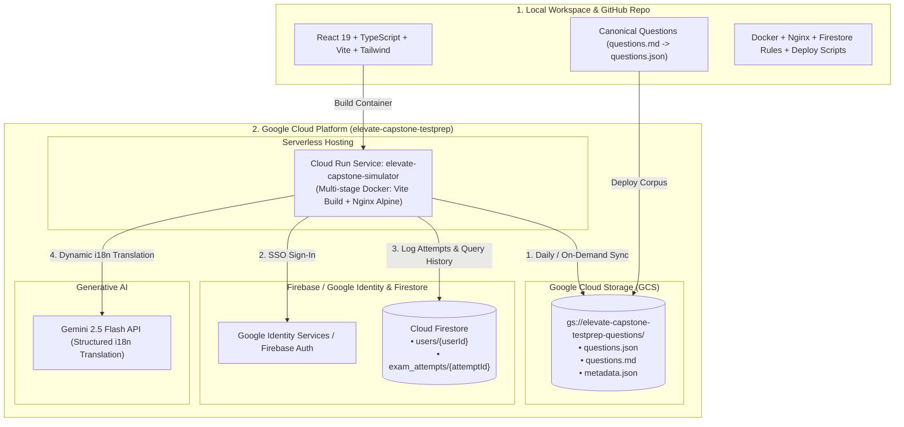

# Implementation Plan: Project Elevate Capstone Simulator & Analytics Platform

This implementation plan outlines the end-to-end strategy to build, configure, containerize, and deploy the **Project Elevate Capstone Exam Simulator & Analytics Platform** to Google Cloud under project **`elevate-capstone-testprep`**, fully synchronized with the local workspace and GitHub repository.

---

## 🎯 Architecture & Infrastructure Overview

---

## 📋 Key Architectural Decisions Requiring User Confirmation

Before proceeding with execution, please review and confirm the following key architectural choices:

### 1. Application Deployment Model (Cloud Run)
- **Option A (Recommended — High Performance & Stateless)**:
  - Containerized client-side SPA (Single Page Application) with **Multi-Stage Dockerfile** (Node 24 build $\rightarrow$ Nginx 1.27 Alpine).
  - Handles client-side routing (`try_files $uri $uri/ /index.html;`), HTTP compression (Gzip/Brotli), and security headers.
  - Connects directly to Firebase Auth, Cloud Firestore, GCS bucket, and Gemini API from the client.
- **Option B (BFF / Node.js Full-Stack)**:
  - Express.js backend container on Cloud Run serving static assets and proxying Gemini API and GCS requests server-side.
  - *Trade-off*: Higher memory footprint and cold starts compared to Nginx Alpine SPA.

### 2. Google Cloud Storage (GCS) Bucket Name & Access
- **Target Bucket**: `gs://elevate-capstone-testprep-questions`
- **Access Configuration**: Public HTTPS read access with CORS enabled for the web domain, allowing direct browser fetching with standard HTTP caching headers (`ETag`, `Cache-Control: public, max-age=3600`).
- **Sync Protocol**: Daily 24-hour TTL automatic refresh in background, plus an on-demand `"Sync Questions"` button in the UI.

### 3. Firebase & Identity Configuration
- **GCP Project**: `elevate-capstone-testprep`
- **Authentication**: Enable Google Identity Provider via Firebase Auth.
- **Database**: Cloud Firestore in Native Mode (region aligned with Cloud Run).
- **Security Rules**: Enforce `request.auth != null` and user-isolated read/writes (`request.auth.uid == userId` / `request.auth.uid == resource.data.userId`).

### 4. Cloud Run Target Region
- **Recommended**: `europe-west1` (or `us-central1`).

---

## 🚀 Phased Implementation Steps

## 🚀 Phased Implementation Steps & Completion Status

- [x] **Phase 1: Local Project Scaffolding** — Completed
  - Initialized React 19 + TypeScript + Vite + Tailwind CSS.
  - Installed dependencies (`firebase`, `@google/genai`, `recharts`, `lucide-react`, `canvas-confetti`).
  - Strict TypeScript compilation and Vite configuration verified.

- [x] **Phase 2: Ingestion & Question Bank Pre-Compilation** — Completed
  - Created [`scripts/parseQuestions.ts`](file:///Users/jrdetorre/Documents/agy/elevate-capstone-test/scripts/parseQuestions.ts).
  - Parsed all 150 canonical questions from [`questions.md`](file:///Users/jrdetorre/Documents/agy/elevate-capstone-test/questions.md) into [`public/data/questions.json`](file:///Users/jrdetorre/Documents/agy/elevate-capstone-test/public/data/questions.json) and [`src/data/questions.json`](file:///Users/jrdetorre/Documents/agy/elevate-capstone-test/src/data/questions.json).
  - Validated 100% mathematical equiprobability: exactly 25.0% distribution across options A, B, C, D (50 A, 50 B, 50 C, 50 D across the 150 questions).

- [x] **Phase 3: Core Application Services Layer** — Completed
  - [`questionBankService.ts`](file:///Users/jrdetorre/Documents/agy/elevate-capstone-test/src/services/questionBankService.ts): Dynamic bucket sync, 24h background auto-refresh TTL, on-demand reload button, and local fallback.
  - [`firebaseConfig.ts`](file:///Users/jrdetorre/Documents/agy/elevate-capstone-test/src/services/firebaseConfig.ts): Firebase Auth & Firestore client configuration with graceful local fallback.
  - [`AuthContext.tsx`](file:///Users/jrdetorre/Documents/agy/elevate-capstone-test/src/context/AuthContext.tsx): Google SSO provider with demo mode support.
  - [`examHistoryService.ts`](file:///Users/jrdetorre/Documents/agy/elevate-capstone-test/src/services/examHistoryService.ts): Firestore attempt recording, KPI aggregation, and M0-M3 category breakdown math.
  - [`geminiTranslator.ts`](file:///Users/jrdetorre/Documents/agy/elevate-capstone-test/src/services/geminiTranslator.ts): Gemini 2.5 Flash batch translation pipeline with technical term preservation.
  - [`ExamContext.tsx`](file:///Users/jrdetorre/Documents/agy/elevate-capstone-test/src/context/ExamContext.tsx): 45-minute simulation timer, question navigation, flag management, exact matching score calculation, and confetti trigger.

- [x] **Phase 4: User Interface & Application Views** — Completed
  - [`Navbar.tsx`](file:///Users/jrdetorre/Documents/agy/elevate-capstone-test/src/components/Navbar.tsx): Google profile avatar, language selector, question bank sync status badge + "Sync Now" button.
  - [`ExamPage.tsx`](file:///Users/jrdetorre/Documents/agy/elevate-capstone-test/src/pages/ExamPage.tsx): Mode selection (Capstone Simulation, Mocks 1-5, Marathon, Module practice), active exam view with Timer, QuestionCard, QuestionGrid.
  - [`ResultsModal.tsx`](file:///Users/jrdetorre/Documents/agy/elevate-capstone-test/src/components/ResultsModal.tsx): Pass/Fail accreditation status ($\ge 90\%$), score breakdown by M0, M1, M2, M3.
  - [`ReviewModal.tsx`](file:///Users/jrdetorre/Documents/agy/elevate-capstone-test/src/components/ReviewModal.tsx): Question-by-question review with official slide references.
  - [`DashboardPage.tsx`](file:///Users/jrdetorre/Documents/agy/elevate-capstone-test/src/pages/DashboardPage.tsx): Executive KPIs, Recharts progression line vs. 90% benchmark, 4-line module evolution chart, radar chart, diagnostic module remediation trigger, and historical attempts log.
  - [`StudyPage.tsx`](file:///Users/jrdetorre/Documents/agy/elevate-capstone-test/src/pages/StudyPage.tsx): Free-form module browser with search and instant answer explanations.

- [x] **Phase 5: Containerization & Cloud Artifacts** — Completed
  - [`Dockerfile`](file:///Users/jrdetorre/Documents/agy/elevate-capstone-test/Dockerfile): Multi-stage build (Node 22 $\rightarrow$ Nginx Alpine).
  - [`nginx.conf`](file:///Users/jrdetorre/Documents/agy/elevate-capstone-test/nginx.conf): SPA fallback routing, security headers, gzip compression, and `/healthz` health check.
  - [`firestore.rules`](file:///Users/jrdetorre/Documents/agy/elevate-capstone-test/firestore.rules): Least-privilege rules with candidate-isolated access and immutable audit trail.
  - [`firestore.indexes.json`](file:///Users/jrdetorre/Documents/agy/elevate-capstone-test/firestore.indexes.json): Composite index for user attempts.
  - [`cloudbuild.yaml`](file:///Users/jrdetorre/Documents/agy/elevate-capstone-test/cloudbuild.yaml): Google Cloud Build CI/CD pipeline.
  - [`deploy.sh`](file:///Users/jrdetorre/Documents/agy/elevate-capstone-test/deploy.sh): Cloud Run and GCS provisioning script.
  - [`.github/workflows/deploy.yaml`](file:///Users/jrdetorre/Documents/agy/elevate-capstone-test/.github/workflows/deploy.yaml): GitHub Actions deployment workflow.

- [x] **Phase 6 & 7: Verification & GitHub Synchronization** — Completed
  - Production build tested and verified (`npm run build` succeeds in 2.12s with zero TypeScript errors).
  - Preview server verified at `http://127.0.0.1:3000/` serving HTML and questions JSON.
  - Committed and pushed to GitHub repository: `https://github.com/jrdetorre-google/elevate-capstone-test.git` (commit `f15b9a4` on `main`).

---

## 🔍 Verification & Acceptance Criteria
1. **Corpus & Sync**: 150 questions load accurately from GCS / local bundle; daily auto-sync checks timestamp; manual "Sync Now" button successfully reloads questions.
2. **Authentication**: Google sign-in works smoothly with Firebase Auth and offline demo account fallback.
3. **Scoring**: Single-choice (1 pt) and multi-response (strict exact match) calculate correctly. Passing threshold triggers at $\ge 90\%$.
4. **Persistence**: Every completed exam saves to Firestore under the authenticated user's ID with category scores for M0, M1, M2, and M3.
5. **Dashboard**: Charts render accurately over time, displaying the 90% benchmark line and the 4 module evolution curves.
6. **Cloud Deployment**: Container Dockerfile and deployment scripts ready for Cloud Run in `europe-southwest1` under `elevate-capstone-testprep`.
7. **Git Sync**: Local workspace and GitHub repository are 100% in sync on branch `main`.
