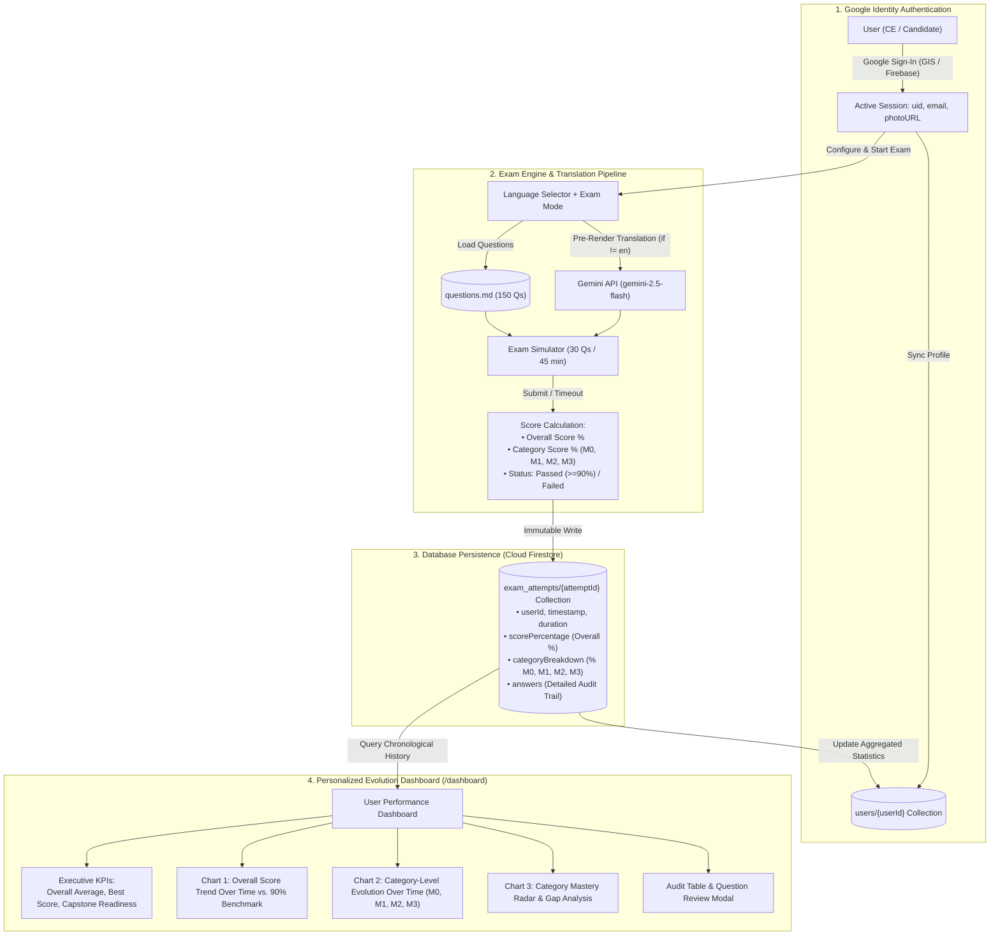

# Multilingual Exam Simulator & Application Specification (SPEC.md) — Project Elevate Capstone (Customer Engineering)

> **Document Purpose**: This `.md` file contains:
> 1. The **strategic analysis** of accreditation objectives and Capstone structure for the **Project Elevate: Advanced Agentic AI** program, extracted from internal documentation in Google Drive, Gmail, and Moma.
> 2. The **Functional and Technical Specification (`SPEC.md`)** ready for direct ingestion by **Google Antigravity 2.0 / CLI** to build a modern interactive web application for exam simulation featuring **Google Identity Authentication**, **database persistence of exam attempt history**, **personalized user dashboard tracking historical performance evolution over time (overall score % and category breakdowns, where categories are strictly the 4 thematic modules: M0, M1, M2, M3)**, and a **dynamic language selector with Gemini API pre-render translation** before questions are displayed on screen.
> 3. The reference to the **Canonical English Question Corpus (150 Questions & Answers)**, managed in a decoupled, independent document at [`questions.md`](questions.md), ensuring a clean architectural separation between application logic and data.

---

## 1. Analysis of Elevate Program Objectives & Capstone Structure

### 1.1 Strategic Objectives of the Project Elevate Program (`go/elevate-site` / `go/elevate-capstone-reg`)
Derived from the analysis of official program communications (`ce-elevate-pgm@google.com`, *"Heads-Up: Your Project Elevate Capstone & Accreditation Journey"*, Day 1 to 5 recaps), **Cloud GTM GRAD 2026 (`go/2026gtmexpectations`)** performance standards, and master presentation decks in Google Drive (`1iAfEumf-CU5uzIboRTfc1DnthokVvfQ2`), the **Project Elevate** program pursues four core objectives:

1. **Transform Customer Engineers (CEs) into Hands-On Agentic AI Architects**:
   - Transition from theoretical presentations or superficial demos (*"vibe coding"* / *PoC illusion*) to enterprise-grade, governed, observable, secure, and production-ready architectures on Google Cloud (**ADK 2.0**, **Gemini Enterprise Agent Platform - GEAP**, **Agent Runtime**, **Agent Registry**, **Agent Identity**, **Agent Gateway**, and **Model Armor**).
2. **Attain the Minimum Technical Standard (4-Stage Core Lifecycle)**:
   - Every CE must be capable of executing and defending the complete end-to-end lifecycle live:
     - **Stage 01 — Agent Definition**: Build or customize an agent using **Google ADK 2.0** (`google.adk.agents.Agent`, `google-agents-cli`).
     - **Stage 02 — Engine Deployment**: Deploy the agent to a managed execution environment (**Agent Engine / Agent Runtime**, **Cloud Run**, or **GKE**).
     - **Stage 03 — Enterprise Integration**: Register the agent in **Agent Registry** and connect it to **Gemini Enterprise (GE)** and enterprise tools via **MCP** and **A2A**.
     - **Stage 04 — Live Interaction**: Conduct a real-time interactive demonstration with OpenTelemetry tracing, golden dataset evaluation, and safety guardrails.
3. **Strict Separation of Internal vs. External Tooling and CE Toil Reduction**:
   - Master **Google Antigravity 2.0** (Desktop App, CLI, and VS Code extension authenticated via **Argolis**) for customer demonstrations, co-creation, and screen sharing safely under the *Google Cloud Terms of Service*.
   - Use **Jetski** (Hub, CLI, Cider, Chat) **strictly for internal productivity** (`google3`, workload analysis in Vector/Concord using `/skill ce-tech-concord-conversational-agent`, Buganizer, administrative toil reduction), and never expose or present it to external clients.
4. **Mandatory Accreditation Tied to GRAD 2026 (`KS1`)**:
   - The **Elevate Capstone** (scheduled between **October 5 and November 6, 2026** in a dedicated 2-day consecutive block, Wednesday and Thursday, with ~**12.5 hours** of estimated dedication) is mandatory for all CEs, PAs, and CEMs, serving as a core component of the **GRAD 2026** standardized expectations (**`KS1: Achieve and Expand Technical Expertise - Successfully pass all components of the Elevate Capstone`**).

### 1.2 Official Structure of the Elevate Capstone Examination
The official Capstone evaluation consists of **3 sequential components** (with credit retention for passed sections and retake windows scheduled in November):

| Capstone Component | Day | Platform | Scope & Evaluated Domain | Passing Threshold |
| :--- | :--- | :--- | :--- | :--- |
| **Part 1: Knowledge Check** | Day 1 | **HackerRank** (Testing Platform) | **30-question conceptual multiple-choice exam** evaluating agentic architectures, ADK 2.0, enterprise data grounding (RAG, MCP Toolbox, Vector DBs, GCS), Context & Harness Engineering, cloud modernization/AWS migration, machine-speed security (CodeMender, Wiz), and governance (Agent Registry, Identity, Gateway, Model Armor, OTel, and cost controls). | **90% minimum** (**27 / 30** correct answers) |
| **Part 2: Troubleshooting Challenge Labs** | Day 1 | **Labs for Sales (LfS)** | Deep hands-on break-fix diagnostic labs where CEs diagnose, debug, and resolve real-world architectural, performance, latency, cost, and runtime issues. | **90% minimum** |
| **Part 3: End-to-End Solutioning (Hands-On Build)** | Day 1 & Day 2 | **AI Evaluator Agent + Labs for Sales (LfS)** | **Phase A (Day 1)**: Architectural discovery and design in response to a unique customer scenario (e.g., *Cymbal Group*), interactively evaluated by an *AI Evaluator Agent*.<br>**Phase B (Day 2)**: Functional deployment of the agentic solution on *Labs for Sales*, validated by an *Automated Evaluation Server*. | **80% minimum** |

### 1.3 Mathematical Corpus Design: 80/20 Ratio and Exact `A, B, C, D` Equiprobability (25.0%)
- **Canonical English Corpus (`Q001`–`Q150`)**: The entire repository of questions, options, and explanations is authored in **English** (the original language of Elevate slide decks and the HackerRank examination) as the authoritative Single Source of Truth.
- **Exact 80% / 20% Question Ratio**:
  - **120 Single-Choice Questions (80.0%)** (`type: "single"`, `num_correct: 1`).
  - **30 Multi-Response Questions (20.0%)** (`type: "multi"`, `num_correct: 2` or `3`, never `4`), consistently labeled in the stem with `*(Select the 2 correct options)*` or `*(Select the 3 correct options)*`.
- **Verified Equiprobability of Options `A`, `B`, `C`, and `D` (25.0% for each option)**:
  - **Across the 120 Single-Choice Questions**:
    - `A`: **30 occurrences** (25.0%) | `B`: **30 occurrences** (25.0%) | `C`: **30 occurrences** (25.0%) | `D`: **30 occurrences** (25.0%).
    - Furthermore, distribution within each individual module is strictly uniform: Module 0 (`9 A, 9 B, 9 C, 9 D`), Module 1 (`7 A, 7 B, 7 C, 7 D`), Module 2 (`7 A, 7 B, 7 C, 7 D`), and Module 3 (`7 A, 7 B, 7 C, 7 D`).
  - **Across the 30 Multi-Response Questions**:
    - For the 10 questions with 2 correct answers, complementary pairs (`AB, CD, AC, BD, AD, BC`) rotate such that `A`, `B`, `C`, and `D` are correct **exactly 5 times each (25.0%)**.
    - For the 20 questions with 3 correct answers, each of the 4 possible combinations (`ABC`, `ABD`, `ACD`, `BCD`) is assigned 5 times, resulting in `A`, `B`, `C`, and `D` being correct **exactly 15 times each (25.0%)**.
    - Multi-Response totals: `A`: **20** (25.0%) | `B`: **20** (25.0%) | `C`: **20** (25.0%) | `D`: **20** (25.0%).
  - **Global Grand Total Across All 150 Questions (200 total correct answer slots)**:
    - `A`: **50 occurrences (25.0%)** | `B`: **50 occurrences (25.0%)** | `C`: **50 occurrences (25.0%)** | `D`: **50 occurrences (25.0%)**.

---

## 2. Specification for Google Antigravity (`SPEC.md`) — Assessment Application with Google Identity, Database History, Evolution Dashboard, and Gemini Dynamic Translation

> **Instructions for Antigravity**: Build a modern, responsive, and performant web application (using **React + TypeScript + Vite + Tailwind CSS + Lucide Icons + Recharts + `@google/genai`**) that loads the **Canonical English Corpus of 150 questions** from [`questions.md`](questions.md) (or `elevate_questions_150.json`) with the following comprehensive architecture:
> 1. **Google Identity & Authentication**: Seamless sign-in via **Google Identity Services (GIS) / Firebase Auth with Google Provider**, capturing user profile data (`uid`, `email`, `displayName`, `photoURL`), session persistence, and route protection.
> 2. **Database & Exam History Persistence**: Persistent storage in **Cloud Firestore / Firebase** for every completed simulation attempt, logging timestamp, exam mode, duration, **overall accuracy percentage**, and **accuracy percentages broken down by question category (where categories are strictly defined as the 4 thematic modules: M0, M1, M2, M3)**, alongside full question-by-question audit records.
> 3. **Personalized Time-Series Evolution Dashboard**: For each authenticated user, a visual performance panel tracking **results evolution over time** via time-series charts (overall % evolution versus the 90% benchmark, and comparative evolution curves for each category: M0, M1, M2, M3), aggregated KPIs, strength/gap diagnostics, and an interactive historical table with question-level review modals.
> 4. **Pre-Render Dynamic Translation via Gemini API**: Exam language selector that translates questions, options, and explanations dynamically via Gemini before rendering on screen, guaranteeing zero layout flicker and strict preservation of official technical terminology.



---

### 2.1 Google Identity & Authentication Pipeline (`Google Identity & Auth Pipeline`)

1. **Authentication Provider and Workflow**:
   - Integration with **Google Identity Services (GIS)** or **Firebase Authentication** using the **Google Provider (`GoogleAuthProvider`)**.
   - Standard OAuth 2.0 / OpenID Connect workflow requesting scopes: `openid`, `email`, `profile`.
   - Optional enterprise domain validation (e.g., allow any Google account or highlight `@google.com` corporate accounts for Google Cloud CEs).
   - Sign-in via popup window or seamless redirect, configured with persistent session storage (`LOCAL_PERSISTENCE`) to prevent unwanted sign-outs on page reloads.

2. **Session State Management (`AuthContext.tsx` & `useAuth` Hook)**:
   - Implement a global React context (`AuthContext`) exposing:
     ```typescript
     interface AuthState {
       user: UserProfile | null;
       isAuthenticated: boolean;
       isLoading: boolean;
       loginWithGoogle: () => Promise<void>;
       logout: () => Promise<void>;
     }
     ```
   - Upon authentication, automatically sync or create the user record in the `users` database collection (including account creation date, last login timestamp, and avatar).

3. **Identity Visual Components**:
   - **Login Screen / Welcome Modal**:
     - Clean, focused landing view for unauthenticated users highlighting the value of the *Project Elevate Capstone* accreditation tool.
     - Official branded action button: *"Sign in with Google"* (following Google branding guidelines with official multicolor icon).
   - **Navigation Bar (`Navbar`)**:
     - When authenticated, displays in the top-right header:
       - Circular avatar with the user's Google profile picture (`photoURL`).
       - User display name (`displayName`) and corporate email (`email`).
       - Direct shortcut to the **Evolution Dashboard** (`/dashboard`) featuring an analytics icon (`TrendingUp` or `BarChart3`).
       - Dropdown menu (*Account Dropdown*) with an explicit **Sign Out** action.
   - **Route Protection & Attempt Flow**:
     - Exam execution (`/exam`) and dashboard analytics (`/dashboard`) routes require active authentication. If an unauthenticated user clicks *"Start Exam"* or *"View History"*, the Google sign-in modal is triggered immediately to guarantee that all results are persisted to their identity.

---

### 2.2 Database Persistence & Data Models (`Database Schema & Persistence`)

Data persistence is powered by **Cloud Firestore** (or compatible GCP / Firebase document database) structured for efficient chronological querying and per-user analytical computations.

#### 2.2.1 Canonical Definition of Categories: The 4 Elevate Modules (M0, M1, M2, M3)

The evaluation categories used for accuracy scoring, database persistence, and time-series visualization in the Dashboard correspond biunivocally to the **4 thematic modules of the Elevate program**:
- **`M0` (Module 0)**: *Module 0: Agentic AI Foundations & ADK* (Questions Q001 to Q045)
- **`M1` (Module 1)**: *Module 1: Cloud Modernization, Context Engineering & MCP* (Questions Q046 to Q080)
- **`M2` (Module 2)**: *Module 2: Machine-Speed Security & Agent Governance* (Questions Q081 to Q115)
- **`M3` (Module 3)**: *Module 3: ADK 2.0, GEAP Evaluation, Harness Engineering, Data & Observability/Cost* (Questions Q116 to Q150)

#### 2.2.2 Cloud Firestore Collection Schema

```
firestore/
├── users/
│   └── {userId}/                      # Consolidated user profile (Google UID)
│       ├── uid: string
│       ├── email: string
│       ├── displayName: string
│       ├── photoURL: string
│       ├── createdAt: timestamp
│       ├── lastLoginAt: timestamp
│       └── stats: { ... }             # Pre-aggregated performance metrics
│
└── exam_attempts/
    └── {attemptId}/                   # Immutable record of each completed exam
        ├── id: string (UUID / DocID)
        ├── userId: string (Google UID)
        ├── userEmail: string
        ├── timestamp: timestamp (ISO 8601 completion timestamp)
        ├── startedAt: timestamp
        ├── completedAt: timestamp
        ├── examMode: string           # "official_simulation_30" | "fixed_mock_1..5" | "marathon_150" | "module_practice"
        ├── targetLanguage: string     # "en" | "es" | "pt" | "fr" | etc.
        ├── durationSeconds: number    # Actual elapsed time in seconds
        ├── totalQuestions: number     # e.g., 30
        ├── correctAnswers: number     # e.g., 28
        ├── scorePercentage: number    # e.g., 93.33 (overall score percentage)
        ├── passed: boolean            # scorePercentage >= 90.0 (official Capstone passing threshold)
        ├── categoryBreakdown: {       # Result breakdown by category (Modules M0..M3)
        │     M0: CategoryScore,       # Module 0: Foundations & ADK
        │     M1: CategoryScore,       # Module 1: Modernization & MCP
        │     M2: CategoryScore,       # Module 2: Security & Governance
        │     M3: CategoryScore        # Module 3: Evaluation, Data & Observability/Cost
        │   }
        └── answers: QuestionAnswerRecord[] # Question-by-question audit log for review
```

#### 2.2.3 TypeScript Types & Interfaces (`types/examHistory.ts`)

```typescript
export interface UserProfile {
  uid: string;
  email: string;
  displayName: string;
  photoURL?: string;
  createdAt: string;
  lastLoginAt: string;
  stats?: {
    totalExams: number;
    passedExams: number;
    averageScore: number;
    bestScore: number;
    lastScore: number;
  };
}

/**
 * Exam categories correspond strictly to the 4 thematic modules: M0, M1, M2, M3
 */
export type ExamCategoryKey = "M0" | "M1" | "M2" | "M3";

export interface CategoryScore {
  categoryId: ExamCategoryKey;
  categoryName: string;
  total: number;
  correct: number;
  percentage: number; // (correct / total) * 100 formatted to 1-2 decimal places
}

export interface QuestionAnswerRecord {
  questionId: string; // e.g., "Q001"
  module: string;     // e.g., "Module 0: Agentic AI Foundations & ADK"
  categoryKey: ExamCategoryKey; // "M0" | "M1" | "M2" | "M3"
  lesson?: string;    // e.g., "M0L1 Introduction"
  type: "single" | "multi";
  userSelected: ("A" | "B" | "C" | "D")[];
  correctOptions: ("A" | "B" | "C" | "D")[];
  isCorrect: boolean;
}

export interface ExamAttempt {
  id: string;
  userId: string;
  userEmail: string;
  timestamp: string;      // ISO 8601 (timeline axis for charts)
  startedAt: string;
  completedAt: string;
  examMode: "official_simulation_30" | "fixed_mock_1" | "fixed_mock_2" | "fixed_mock_3" | "fixed_mock_4" | "fixed_mock_5" | "marathon_150" | "module_practice";
  targetLanguage: string;
  durationSeconds: number;
  totalQuestions: number;
  correctAnswers: number;
  scorePercentage: number; // Overall percentage
  passed: boolean;         // scorePercentage >= 90.0
  categoryBreakdown: Record<ExamCategoryKey, CategoryScore>;
  answers: QuestionAnswerRecord[];
}

export interface UserDashboardMetrics {
  totalExams: number;
  passedExams: number;
  passRatePercentage: number;
  averageGlobalScore: number;
  bestGlobalScore: number;
  lastGlobalScore: number;
  totalTimePracticedSeconds: number;
  capstoneReadiness: "READY" | "IN_PROGRESS" | "NEEDS_IMPROVEMENT";
  evolutionTimeline: {
    attemptId: string;
    timestamp: string;
    formattedDate: string;
    examMode: string;
    scorePercentage: number;
    passed: boolean;
    durationSeconds: number;
    M0: number; // % accuracy in Module 0
    M1: number; // % accuracy in Module 1
    M2: number; // % accuracy in Module 2
    M3: number; // % accuracy in Module 3
  }[];
  categoryAggregates: {
    categoryId: ExamCategoryKey;
    categoryName: string;
    averagePercentage: number;
    totalAttemptedQuestions: number;
    totalCorrectQuestions: number;
    status: "MASTERED" | "ADEQUATE" | "NEEDS_FOCUS";
  }[];
  weakestCategory: {
    categoryId: ExamCategoryKey;
    categoryName: string;
    averagePercentage: number;
  } | null;
}
```

#### 2.2.4 Reference Implementation of the History Service (`examHistoryService.ts`)

```typescript
import {
  getFirestore,
  collection,
  doc,
  addDoc,
  getDocs,
  query,
  where,
  orderBy,
  limit,
  serverTimestamp,
  updateDoc
} from "firebase/firestore";
import { ExamAttempt, UserDashboardMetrics, ExamCategoryKey, CategoryScore } from "../types/examHistory";

const CATEGORY_NAMES: Record<ExamCategoryKey, string> = {
  M0: "Module 0: Foundations & ADK",
  M1: "Module 1: Modernization & MCP",
  M2: "Module 2: Security & Governance",
  M3: "Module 3: Evaluation, Data & Observability/Cost",
};

export async function saveExamAttemptToDatabase(
  attemptData: Omit<ExamAttempt, "id" | "timestamp">
): Promise<string> {
  const db = getFirestore();
  const collectionRef = collection(db, "exam_attempts");

  const docRef = await addDoc(collectionRef, {
    ...attemptData,
    timestamp: serverTimestamp(),
  });

  // Update aggregated user statistics in /users/{userId}
  await updateUserAggregatedStats(attemptData.userId, attemptData.scorePercentage, attemptData.passed);

  return docRef.id;
}

export async function getUserExamHistory(
  userId: string,
  maxResults = 50
): Promise<ExamAttempt[]> {
  const db = getFirestore();
  const q = query(
    collection(db, "exam_attempts"),
    where("userId", "==", userId),
    orderBy("timestamp", "desc"),
    limit(maxResults)
  );

  const snapshot = await getDocs(q);
  return snapshot.docs.map((docSnap) => {
    const data = docSnap.data();
    return {
      ...data,
      id: docSnap.id,
      timestamp: data.timestamp?.toDate ? data.timestamp.toDate().toISOString() : new Date().toISOString(),
    } as ExamAttempt;
  });
}

export function computeDashboardMetrics(attempts: ExamAttempt[]): UserDashboardMetrics {
  if (attempts.length === 0) {
    return {
      totalExams: 0,
      passedExams: 0,
      passRatePercentage: 0,
      averageGlobalScore: 0,
      bestGlobalScore: 0,
      lastGlobalScore: 0,
      totalTimePracticedSeconds: 0,
      capstoneReadiness: "NEEDS_IMPROVEMENT",
      evolutionTimeline: [],
      categoryAggregates: [],
      weakestCategory: null,
    };
  }

  // Chronological ascending order for time-series charts
  const chronological = [...attempts].reverse();
  const totalExams = attempts.length;
  const passedExams = attempts.filter((a) => a.passed).length;
  const passRatePercentage = Number(((passedExams / totalExams) * 100).toFixed(1));
  const averageGlobalScore = Number(
    (attempts.reduce((acc, a) => acc + a.scorePercentage, 0) / totalExams).toFixed(1)
  );
  const bestGlobalScore = Math.max(...attempts.map((a) => a.scorePercentage));
  const lastGlobalScore = chronological[chronological.length - 1].scorePercentage;
  const totalTimePracticedSeconds = attempts.reduce((acc, a) => acc + a.durationSeconds, 0);

  // Capstone Readiness score based on the last 3 simulation attempts
  const recentThree = chronological.slice(-3);
  const recentPassCount = recentThree.filter((a) => a.scorePercentage >= 90.0).length;
  const capstoneReadiness: "READY" | "IN_PROGRESS" | "NEEDS_IMPROVEMENT" =
    recentThree.length >= 3 && recentPassCount === 3
      ? "READY"
      : recentThree.length > 0 && recentThree.every((a) => a.scorePercentage >= 80.0)
      ? "IN_PROGRESS"
      : "NEEDS_IMPROVEMENT";

  // Chronological timeline with overall score and category breakdown (M0, M1, M2, M3)
  const evolutionTimeline = chronological.map((a, idx) => ({
    attemptId: a.id,
    timestamp: a.timestamp,
    formattedDate: new Date(a.timestamp).toLocaleDateString(undefined, {
      month: "short",
      day: "numeric",
      hour: "2-digit",
      minute: "2-digit",
    }),
    examMode: a.examMode,
    scorePercentage: a.scorePercentage,
    passed: a.passed,
    durationSeconds: a.durationSeconds,
    M0: a.categoryBreakdown.M0?.percentage ?? 0,
    M1: a.categoryBreakdown.M1?.percentage ?? 0,
    M2: a.categoryBreakdown.M2?.percentage ?? 0,
    M3: a.categoryBreakdown.M3?.percentage ?? 0,
  }));

  // Historical aggregated breakdown by category (the 4 modules: M0, M1, M2, M3)
  const categoryKeys: ExamCategoryKey[] = ["M0", "M1", "M2", "M3"];
  const categoryAggregates = categoryKeys.map((key) => {
    let catTotal = 0;
    let catCorrect = 0;
    attempts.forEach((a) => {
      const breakdown = a.categoryBreakdown[key];
      if (breakdown) {
        catTotal += breakdown.total;
        catCorrect += breakdown.correct;
      }
    });
    const avg = catTotal > 0 ? Number(((catCorrect / catTotal) * 100).toFixed(1)) : 0;
    const status: "MASTERED" | "ADEQUATE" | "NEEDS_FOCUS" =
      avg >= 90 ? "MASTERED" : avg >= 80 ? "ADEQUATE" : "NEEDS_FOCUS";
    return {
      categoryId: key,
      categoryName: CATEGORY_NAMES[key],
      averagePercentage: avg,
      totalAttemptedQuestions: catTotal,
      totalCorrectQuestions: catCorrect,
      status,
    };
  });

  const sortedByAvg = [...categoryAggregates].sort((a, b) => a.averagePercentage - b.averagePercentage);
  const weakestCategory = sortedByAvg[0] || null;

  return {
    totalExams,
    passedExams,
    passRatePercentage,
    averageGlobalScore,
    bestGlobalScore,
    lastGlobalScore,
    totalTimePracticedSeconds,
    capstoneReadiness,
    evolutionTimeline,
    categoryAggregates,
    weakestCategory,
  };
}
```

#### 2.2.5 Database Security Rules (`firestore.rules`)
To guarantee privacy and strict isolation for each candidate's data:
```javascript
rules_version = '2';
service cloud.firestore {
  match /databases/{database}/documents {
    // Users can only read and update their own profile document
    match /users/{userId} {
      allow read, write: if request.auth != null && request.auth.uid == userId;
    }
    // Users can only create and access their own exam attempt records
    match /exam_attempts/{attemptId} {
      allow create: if request.auth != null && request.auth.uid == request.resource.data.userId;
      allow read, update, delete: if request.auth != null && request.auth.uid == resource.data.userId;
    }
  }
}
```

---

### 2.3 User Progress, Analytics & Time-Series Evolution Dashboard (`/dashboard`)

The analytics dashboard (`/dashboard`) provides an exhaustive and motivating view of each candidate's individual progress throughout preparation weeks leading up to the Capstone.

```
┌─────────────────────────────────────────────────────────────────────────────────────────────┐
│  EVOLUTION DASHBOARD: Maria Gonzalez (magonzalez@google.com)                  [New Exam ↗]  │
├─────────────────────────────────────────────────────────────────────────────────────────────┤
│  [ KPI 1: Attempts ]   [ KPI 2: Overall Avg ]   [ KPI 3: Best Score ]  [ KPI 4: Readiness ] │
│      14 Completed              91.4%                    96.7%           🟢 EXAM READY (3/3) │
├─────────────────────────────────────────────────────────────────────────────────────────────┤
│  CHART 1: OVERALL SCORE TREND OVER TIME vs. OFFICIAL PASSING BENCHMARK (90%)                │
│  100% ┼───────────────────────────────●─────────●────────●──── (93.3%)                     │
│   90% ┊- - - - - - - - - - - - - - - - - - - - - - - - - - - - - Passing Benchmark (90%)    │
│   80% ┼────────●─────────●───────────────────────────────────                              │
│   70% ┼───●──────────────────────────────────────────────────                              │
│       └───Attempt 1───Attempt 2───Attempt 3───Attempt 4───Attempt 5 (Timeline Axis)         │
├─────────────────────────────────────────────────────────────────────────────────────────────┤
│  CHART 2: CATEGORY-LEVEL EVOLUTION OVER TIME (M0, M1, M2, M3)                               │
│  [■ M0: Foundations]  [■ M1: Modernization]  [■ M2: Security]  [■ M3: Evaluation & Costs]   │
│  100% ┼───────────────────M1 (100%)──────────────────────────                              │
│   90% ┼───────────────M3 (92.5%)─────────────────────────────                              │
│   80% ┼───────M0 (88.9%)─────────────────────────────────────                              │
│   70% ┼───M2 (78.0% - Focus Area)────────────────────────────                              │
├─────────────────────────────────────────────────────────────────────────────────────────────┤
│  CATEGORY MASTERY / RADAR BARS                │  AUTOMATED REINFORCEMENT DIAGNOSTIC         │
│  M0 Foundations:     88.9% [========  ]       │  ⚠️ Module 2 (Security & Governance) is    │
│  M1 Modernization:  100.0% [==========]       │  your lowest area (78.0%). Focused         │
│  M2 Security:        78.0% [=======   ]       │  practice is strongly recommended.          │
│  M3 Evaluation/Cost: 92.5% [========= ]       │  [Practice Module 2 in Study Mode →]        │
├─────────────────────────────────────────────────────────────────────────────────────────────┤
│  FULL ATTEMPT HISTORY                                                                       │
│  Date        Mode             Lang    Duration   Overall   M0    M1    M2    M3    Actions    │
│  Sep 25 14:10 Capstone 30Q     es      28m 42s    93.3% ✔  89%  100%   86%  100%   [Review]  │
│  Sep 24 18:20 Fixed Mock #1    en      31m 15s    90.0% ✔  89%  100%   71%  100%   [Review]  │
│  Sep 22 09:45 Capstone 30Q     es      35m 10s    83.3% ✘  78%   86%   71%   86%   [Review]  │
└─────────────────────────────────────────────────────────────────────────────────────────────┘
```

#### 2.3.1 Dashboard Components

1. **Executive Metrics & KPI Bar**:
   - **Simulations Completed**: Total count of completed mock exams alongside total accumulated study time (in hours and minutes).
   - **Average Overall Accuracy**: Weighted historical average across all attempts.
   - **Personal Best Score**: Highest score achieved with date and exam mode.
   - **Pass Rate**: Percentage of exams meeting or exceeding the **90%** threshold (e.g., `11/14 (78.6%)`).
   - **"Capstone Readiness Index" Traffic Light**:
     - 🟢 **Exam Ready**: The last 3 official 30-question simulations achieved $\ge 90\%$.
     - 🟡 **In Progress**: Average is between $80\%$ and $89\%$, or 1–2 of the last 3 attempts passed.
     - 🔴 **Action Required**: Average is below $80\%$; candidate is alerted that they are currently at risk of failing HackerRank.

2. **Chart 1: Overall Score Trend Over Time (`Overall Score Trend Over Time`)**:
   - Time-series chart (`Recharts LineChart`) plotting sequential exam attempts along the horizontal axis ($X$) against the overall score percentage ($0\%\dots 100\%$) on the vertical axis ($Y$).
   - **Official 90% Benchmark Line**: Horizontal dashed line in red or amber with visible label: *"Official Capstone Passing Benchmark (90%)"*. Allows the user to visually verify whether their learning curve remains steadily above the accreditation line.
   - Interactive dots with rich hover tooltips displaying: date/time, exam mode, language used, elapsed duration, and exact score (e.g., `28 / 30 correct — 93.3%`).

3. **Chart 2: Category-Level Evolution Over Time (`Category-Level Evolution Over Time — M0, M1, M2, M3`)**:
   - Evaluation categories correspond strictly to the **4 thematic modules of the exam (M0, M1, M2, M3)**.
   - Multi-line time-series chart rendering 4 distinct color-coded curves:
     - 🔵 **M0 (Module 0)**: *Agentic AI Foundations & ADK* (`#3B82F6` / Blue)
     - 🟢 **M1 (Module 1)**: *Cloud Modernization, Context Engineering & MCP* (`#10B981` / Emerald Green)
     - 🟠 **M2 (Module 2)**: *Machine-Speed Security & Agent Governance* (`#F59E0B` / Amber Orange)
     - 🟣 **M3 (Module 3)**: *ADK 2.0, GEAP Evaluation, Harness Engineering, Data & Observability/Cost* (`#8B5CF6` / Violet)
   - Enables users to diagnose whether overall evolution stems from balanced mastery across all subjects or if one specific module is lagging while others advance.
   - Interactive checkbox toggle allowing users to isolate or compare any subset of categories (e.g., enable only M2 to inspect targeted study impact).

4. **Chart 3: Category Mastery & Gap Analysis (`Category Mastery & Gap Analysis`)**:
   - Radar or Horizontal Bar chart comparing cumulative historical category averages against the 90% target.
   - **Automated Reinforcement Diagnostic**:
     - Identifies the module with the lowest historical average score.
     - Emits a prescriptive alert: *"Your lowest-performing category is 'Module 2: Machine-Speed Security & Agent Governance' (78.0%). To guarantee passing on HackerRank, focus your practice on this area."*
     - Direct action button: *"Practice Module 2 in Study Mode"* (redirects to the study simulator pre-filtered to M2).

5. **Historical Attempt Table & Interactive Audit**:
   - Sortable, paginated data table displaying each attempt recorded in Firestore.
   - Columns: *Date*, *Mode*, *Language*, *Duration*, *Overall Score* (green `PASSED` or red `FAILED` badge), *Category Progress Mini-bars (M0, M1, M2, M3)*, and a **"Review Exam"** action button.
   - **Exam Review Modal**: Clicking "Review Exam" loads the saved `answers` array from Firestore, presenting each question with user-selected options, correct answers highlighted in green, and full official slide explanations.

---

### 2.4 Language Selection & Real-Time Translation Pipeline with Gemini (`Pre-Render Translation Pipeline`)

1. **Exam Language Selector (`Language Selector`)**:
   - Accessible in the initial exam configuration screen and top navbar, allowing the user to select their desired exam language:
     - `English (en)` — **Canonical base language (Default)**: rendered directly from the English corpus with **zero latency** and zero API calls.
     - `Español (es)` — Spanish (technical cloud engineering terminology).
     - `Português (pt)` — Portuguese.
     - `Français (fr)` — French.
     - `Deutsch (de)` — German.
     - `Italiano (it)` — Italian.
     - `日本語 (ja)` — Japanese.
     - `한국어 (ko)` — Korean.
     - `Custom Language` — Free text field where users can specify any other target language (e.g., `Català`, `Euskera`, `Polski`, `Nederlands`, `Hindi`).
   - Selected language preference is saved to the user's Firestore profile (`preferredLanguage`) to persist across sessions.

2. **Gemini API Key Configuration in UI**:
   - Supports automated retrieval from environment variable `VITE_GEMINI_API_KEY` (or `GEMINI_API_KEY`) and provides an in-app settings modal (`API Settings`) where users can input or update their `Gemini API Key` (persisted in `localStorage`) and select the translation model (`gemini-2.5-flash` by default for ultra-low latency, or `gemini-3.7-flash` / `gemini-2.5-pro`).

3. **Pre-Render Translation Workflow (`Translate-Before-Render`)**:
   - When the selected language `targetLanguage !== "en"`:
     - **English questions never flicker or show briefly before translation**: while Gemini generates translations, the UI displays an elegant loading skeleton/progress indicator (*Skeleton Loader / Progress Bar*: `"Translating exam questions to [Language] via Gemini..."*) and **only renders questions on screen (and starts the exam timer) once translation is fully ready**.
     - **Dual Translation Strategy + Persistent Local Cache**:
       - **In Exam Mode (30 questions)**: When clicking *"Start Exam"*, the app selects the 30 English questions, checks which questions are already cached locally in `localStorage` under `elevate_i18n_${targetLanguage}_${question.id}`, and translates remaining questions by calling Gemini in parallel batches of 5 to 10 questions using **Structured Outputs (`responseSchema`)**. Once all 30 questions are translated, the exam view mounts and the 45-minute countdown begins.
       - **In Study / Marathon Mode (150 questions)**: Translates the active question on demand (and asynchronously prefetches the next 3 questions in the module) prior to display, caching each item in `localStorage` so revisiting or navigating backwards is instantaneous.

4. **Technical Preservation Rules for the Gemini Translation Prompt**:
   - The system prompt sent to Gemini must enforce:
     - **Preserve identifiers and keys verbatim**: `id` (`Q001`..`Q150`), `options` keys (`"A"`, `"B"`, `"C"`, `"D"`), the `correct` array, and the integer `num_correct` **must never be altered under any circumstances**.
     - **Preserve official Google Cloud & Elevate technical terms in English**: product names, CLI commands, metrics, and protocols such as `Agent Runtime`, `Agent Engine`, `Agent Registry`, `Agent Identity`, `Agent Gateway`, `Model Armor`, `ADK`, `MCP`, `A2A`, `SPIFFE`, `CodeMender`, `Antigravity`, `Jetski`, `Golden Dataset`, `tool_trajectory_avg_score`, `response_match_score`, `Hill Climbing`, `Context Rot`, `PR Slop`, `Architectural Drift`, `Harness Engineering`, `Span`, `Trace`, `Session`, `Task` must remain in English or include the original English term alongside.
     - **Translate explicit multi-choice instructions**: for instance, `*(Select the 2 correct options)*` must be translated into the target language (e.g., in Spanish: `*(Selecciona las 2 opciones correctas)*`; in French: `*(Sélectionnez les 2 bonnes réponses)*`, etc.).
   - Include an optional toggle on each question card (`"Show original English"`) allowing candidates to reference the canonical English text at any time without losing the translated interface.

---

### 2.5 Reference Implementation: Translation Utility with Gemini API (`geminiTranslator.ts`)

```typescript
import { GoogleGenAI, Type, Schema } from "@google/genai";

export interface ExamQuestion {
  id: string;
  module: string;
  source: string;
  type: "single" | "multi";
  num_correct: number;
  question: string;
  options: { A: string; B: string; C: string; D: string };
  correct: ("A" | "B" | "C" | "D")[];
  explanation: string;
}

const TRANSLATED_BATCH_SCHEMA: Schema = {
  type: Type.ARRAY,
  items: {
    type: Type.OBJECT,
    properties: {
      id: { type: Type.STRING },
      module: { type: Type.STRING },
      question: { type: Type.STRING },
      options: {
        type: Type.OBJECT,
        properties: {
          A: { type: Type.STRING },
          B: { type: Type.STRING },
          C: { type: Type.STRING },
          D: { type: Type.STRING },
        },
        required: ["A", "B", "C", "D"],
      },
      explanation: { type: Type.STRING },
    },
    required: ["id", "module", "question", "options", "explanation"],
  },
};

export async function translateQuestionsBeforeRender(
  questions: ExamQuestion[],
  targetLanguage: string,
  apiKey: string,
  modelName = "gemini-2.5-flash"
): Promise<ExamQuestion[]> {
  if (!targetLanguage || targetLanguage.toLowerCase() === "en" || targetLanguage.toLowerCase() === "english") {
    return questions;
  }

  const ai = new GoogleGenAI({ apiKey });
  const resultsMap = new Map<string, ExamQuestion>();
  const toTranslate: ExamQuestion[] = [];

  // 1. Check local storage translation cache
  for (const q of questions) {
    const cacheKey = `elevate_i18n_v1_${targetLanguage}_${q.id}`;
    const cached = localStorage.getItem(cacheKey);
    if (cached) {
      try {
        resultsMap.set(q.id, JSON.parse(cached));
        continue;
      } catch {
        localStorage.removeItem(cacheKey);
      }
    }
    toTranslate.push(q);
  }

  // 2. Translate remaining questions in parallel batches before rendering
  const chunkSize = 6;
  for (let i = 0; i < toTranslate.length; i += chunkSize) {
    const chunk = toTranslate.slice(i, i + chunkSize);
    const payload = chunk.map((q) => ({
      id: q.id,
      module: q.module,
      question: q.question,
      options: q.options,
      explanation: q.explanation,
    }));

    const prompt = `Translate the following Google Cloud Project Elevate Capstone exam questions from English into ${targetLanguage}.
CRITICAL RULES:
1. Keep the exact same "id" and option keys ("A", "B", "C", "D"). Do NOT reorder options A, B, C, or D.
2. Preserve official Google Cloud product names, CLI flags, code snippets, and technical terms (e.g., Agent Runtime, Agent Registry, Agent Identity, Agent Gateway, Model Armor, ADK, MCP, A2A, SPIFFE, CodeMender, Antigravity, Jetski, tool_trajectory_avg_score, response_match_score).
3. Translate the explicit multi-choice instruction at the end of multi-response questions (e.g., "*(Select the 2 correct options)*" or "*(Select the 3 correct options)*") naturally into ${targetLanguage}.
4. Return ONLY valid JSON matching the requested schema.

Input JSON:
${JSON.stringify(payload, null, 2)}`;

    const response = await ai.models.generateContent({
      model: modelName,
      contents: prompt,
      config: {
        responseMimeType: "application/json",
        responseSchema: TRANSLATED_BATCH_SCHEMA,
        temperature: 0.1,
      },
    });

    const translatedItems = JSON.parse(response.text || "[]");
    for (const orig of chunk) {
      const tr = translatedItems.find((item: any) => item.id === orig.id);
      const merged: ExamQuestion = tr
        ? {
            ...orig,
            module: tr.module,
            question: tr.question,
            options: {
              A: tr.options.A,
              B: tr.options.B,
              C: tr.options.C,
              D: tr.options.D,
            },
            explanation: tr.explanation,
          }
        : orig;
      localStorage.setItem(`elevate_i18n_v1_${targetLanguage}_${orig.id}`, JSON.stringify(merged));
      resultsMap.set(orig.id, merged);
    }
  }

  return questions.map((q) => resultsMap.get(q.id) || q);
}
```

---

### 2.6 Supported Exam Modes & Persistence Workflow

Upon completing any of the following exam modes, the application automatically evaluates user answers, computes the **overall accuracy percentage** and **category-level accuracy percentages**, and persists the attempt in Firestore's `exam_attempts` collection associated with the authenticated user's `userId`.

1. **Official Capstone Simulation Mode (30 Questions — HackerRank Style)**:
   - Randomly samples **30 questions** from the corpus strictly preserving the **80% Single-Choice (24 questions)** and **20% Multi-Response (6 questions)** proportion, while respecting proportional module weighting (**9 from M0, 7 from M1, 7 from M2, and 7 from M3**).
   - If a language other than English is selected, pre-translates the batch of 30 questions via Gemini while displaying an animated progress bar (`0 / 30 translated`), and starts the **45-minute countdown** only when translation is 100% complete.
   - Evaluates passing against the official **90% threshold (minimum 27/30 correct answers)**.
   - **Submission Workflow**: On time expiry or clicking *"Submit Exam"*, the attempt document is created, saved to Firestore, and the results screen displays the verdict alongside a direct link to the Dashboard.

2. **Fixed Mock Exams Mode (Mocks 1 to 5)**:
   - Partitions all 150 questions into **5 fixed, non-overlapping 30-question mock exams** (each containing 24 `single` and 6 `multi` questions) to cover 100% of the curriculum without repetition.
   - Each completed attempt is saved to Firestore tagged with its specific mode (`fixed_mock_1`..`5`), enabling side-by-side progression analysis across all 5 mocks in the dashboard.

3. **Full 150-Question Marathon Mode**:
   - Allows users to answer all 150 questions sequentially with automatic local state persistence in `localStorage` and Firestore commit upon completion.

4. **Study / Practice by Module Mode (Module 0, 1, 2, or 3)**:
   - Enables filtering by specific module or lesson, pre-translating prior to display and providing immediate feedback with a **"Check Answer"** action. Allows users to specifically train on their weakest category identified in the Dashboard.

---

### 2.7 UI Rules, Scoring Rules & Mathematical Accuracy Formulas

#### 2.7.1 Mathematical Formulas for Accuracy Percentages
- **Overall Score Percentage**:
  $$\text{Overall Score (\%)} = \left( \frac{\sum_{i=1}^{N} \text{Correct}_i}{N} \right) \times 100$$
  where $N$ is the total number of questions in the exam attempt (e.g., $N=30$) and $\text{Correct}_i \in \{0, 1\}$.

- **Category Score Percentage $c$ (where categories are modules M0, M1, M2, M3)**:
  $$\text{Category Score}_c \text{ (\%)} = \left( \frac{\sum_{j \in C_c} \text{Correct}_j}{|C_c|} \right) \times 100, \quad c \in \{\text{M0}, \text{M1}, \text{M2}, \text{M3}\}$$
  where $C_c$ is the subset of questions belonging to category/module $c$ ($c \in \{\text{M0}, \text{M1}, \text{M2}, \text{M3}\}$), and $|C_c|$ is the total number of questions of that category in the evaluated exam.

- **Official Capstone Passing Criteria (HackerRank Standard)**:
  $$\text{Passed} \iff \text{Overall Score (\%)} \ge 90.0\% \quad (\text{e.g., } \ge 27 \text{ of } 30 \text{ questions answered correctly})$$

#### 2.7.2 Interface Controls & Strict Scoring Rules
- **Single-Choice Questions (`type: "single"`, `num_correct: 1`)**:
  - Render with **Radio Button** controls (only 1 option selectable among `A, B, C, D`).
  - Display badge: `Single-Choice (Select 1 option)`.
  - Scoring: 1 point if the selected option matches `correct[0]`; 0 points otherwise.

- **Multi-Response Questions (`type: "multi"`, `num_correct: 2` or `3`)**:
  - Render with **Checkbox** controls allowing multiple selections.
  - Display prominent amber/blue badge: `Multi-Response — Select exactly X correct options` (where `X` is `2` or `3`, never `4`).
  - Validate in UI that the user has selected exactly `num_correct` options before enabling progress (`Selected: k / X`).
  - **Strict Scoring Rule (Capstone Standard)**: A multi-response question earns **1 point if and only if the set of chosen options exactly matches the `correct` array**. No partial credit is awarded: selecting 2 correct options out of 3, or selecting 1 correct and 1 incorrect, scores 0 points.

---

## 3. Canonical Question Repository (`questions.md`)

> **Architectural Separation of Specification and Question Corpus**:
> To ensure modularity, maintainability, and clean decoupling, the complete corpus of 150 exam questions and answers is managed independently in:
> 
> 📄 **Canonical Question Document**: [`questions.md`](questions.md)

### 3.1 Structure & Metadata in `questions.md`
The file [`questions.md`](questions.md) serves as the authoritative **Single Source of Truth** and contains:
- **150 English questions and answers (`Q001` to `Q150`)**, covering 100% of the 25 official Project Elevate lessons across all 4 modules:
  - **Module 0**: *Agentic AI Foundations & ADK* (45 questions, `Q001`–`Q045`)
  - **Module 1**: *Cloud Modernization, Context Engineering & MCP* (35 questions, `Q046`–`Q080`)
  - **Module 2**: *Machine-Speed Security & Agent Governance* (35 questions, `Q081`–`Q115`)
  - **Module 3**: *ADK 2.0, GEAP Evaluation, Harness Engineering, Data & Observability/Cost* (35 questions, `Q116`–`Q150`)
- **Balanced, Equiprobable Mathematical Distribution**:
  - **120 Single-Choice Questions (80.0%)**: Symmetric distribution of 30 correct answers per letter (**25.0% `A`, 25.0% `B`, 25.0% `C`, 25.0% `D`**).
  - **30 Multi-Response Questions (20.0%)**: 10 questions with 2 correct answers and 20 questions with 3 correct answers (**0 questions with all 4 correct**), with exactly 20 correct appearances per letter (**25.0% `A`, 25.0% `B`, 25.0% `C`, 25.0% `D`**).
  - **Global Equiprobability Across All 200 Correct Option Slots**: **50 `A` (25.0%), 50 `B` (25.0%), 50 `C` (25.0%), 50 `D` (25.0%)**.
- Each question defines:
  - `id`: Unique identifier (`Q001` to `Q150`).
  - `module`: Source module and lesson (e.g., `[M0L1 Introduction]`).
  - `type`: Question format (`Single-Choice` or `Multi-Response`).
  - `num_correct`: Exact number of correct options (`1`, `2`, or `3`).
  - `question`: Technical question stem in English.
  - `options`: 4 mutually exclusive options (`A`, `B`, `C`, `D`).
  - `correct`: Key(s) of correct option(s).
  - `explanation`: Detailed explanation referencing official Elevate course material and slides.

### 3.2 Ingestion & Loading into the Application
The web application (React/TypeScript) must ingest questions via either of the following approaches:
1. **Build-Time / Runtime Markdown Parser**: An ingestion utility that reads [`questions.md`](questions.md) and parses `#### Qxxx` blocks into an array of `ExamQuestion[]` objects.
2. **JSON Build Artifact Generation (`elevate_questions_150.json`)**: Direct pre-compilation into a static JSON asset for zero-overhead client loading.
