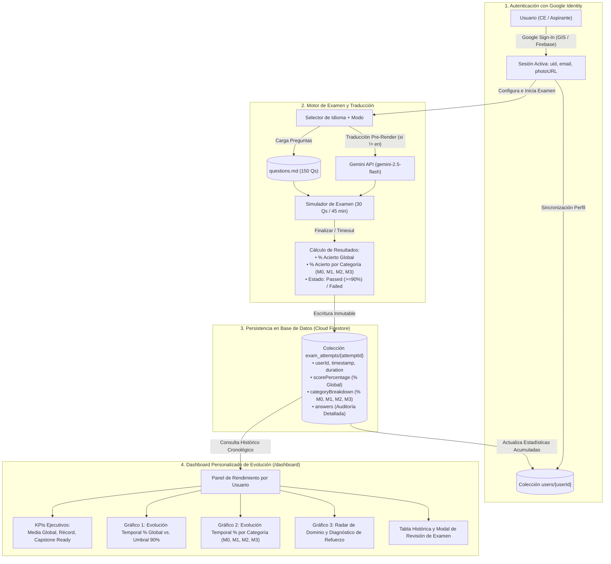

# Sistema de Evaluación y Especificación de Aplicación Multilingüe (SPEC.md) — Project Elevate Capstone (Customer Engineering)

> **Propósito de este documento**: Este archivo `.md` contiene:
> 1. El **análisis estratégico** de los objetivos y estructura de acreditación del programa **Project Elevate: Advanced Agentic AI** extraído de la documentación interna de Google Drive, Gmail y Moma.
> 2. La **Especificación Funcional y Técnica (`SPEC.md`)** lista para ser ingerida directamente por **Google Antigravity 2.0 / CLI** con el fin de construir una aplicación web interactiva de simulación de examen con **autenticación mediante Google Identity**, **persistencia en base de datos del histórico de simulacros**, **dashboard personalizado con la evolución temporal del porcentaje de acierto global y por categorías**, y **selector de idioma con traducción dinámica mediante Gemini API** antes de mostrar las preguntas en pantalla.
> 3. La referencia al **Corpus Canónico en Inglés (`English Corpus`) de 150 Preguntas y Respuestas**, el cual se gestiona de forma desacoplada e independiente en el archivo [`questions.md`](questions.md), garantizando una separación limpia entre lógica de aplicación y datos.

---

## 1. Análisis de Objetivos del Programa Elevate y Estructura del Capstone

### 1.1 Objetivos Estratégicos del Programa Project Elevate (`go/elevate-site` / `go/elevate-capstone-reg`)
A partir del análisis de los correos oficiales del programa (`ce-elevate-pgm@google.com`, *"Heads-Up: Your Project Elevate Capstone & Accreditation Journey"*, recaps de los Días 1 a 5), las expectativas de rendimiento de **Cloud GTM GRAD 2026 (`go/2026gtmexpectations`)** y las presentaciones maestras del repositorio de Google Drive (`1iAfEumf-CU5uzIboRTfc1DnthokVvfQ2`), el programa **Project Elevate** persigue cuatro objetivos esenciales:

1. **Transformar a los Customer Engineers (CEs) en Arquitectos Prácticos de IA Agéntica (*Hands-On Agentic AI Architects*)**:
   - Pasar de presentaciones teóricas o demostraciones superficiales (*"vibe coding"* / *PoC illusion*) a arquitecturas empresariales gobernadas, observables, seguras y desplegadas en producción sobre Google Cloud (**ADK 2.0**, **Gemini Enterprise Agent Platform - GEAP**, **Agent Runtime**, **Agent Registry**, **Agent Identity**, **Agent Gateway** y **Model Armor**).
2. **Alcanzar el *Minimum Technical Standard* (Flujo Base de 4 Etapas)**:
   - Todo CE debe ser capaz de ejecutar y defender en vivo el ciclo completo:
     - **Etapa 01 — Agent Definition**: Construir o tomar un agente utilizando **Google ADK 2.0** (`google.adk.agents.Agent`, `google-agents-cli`).
     - **Etapa 02 — Engine Deployment**: Desplegar el agente en un entorno de ejecución gestionado (**Agent Engine / Agent Runtime**, **Cloud Run** o **GKE**).
     - **Etapa 03 — Enterprise Integration**: Registrar el agente en **Agent Registry** y conectarlo con **Gemini Enterprise (GE)** y herramientas empresariales vía **MCP** y **A2A**.
     - **Etapa 04 — Live Interaction**: Realizar una demostración interactiva en tiempo real con trazabilidad OpenTelemetry, evaluación con *Golden Datasets* y guardarraíles de seguridad.
3. **Separación Estricta de Herramientas Internas vs. Externas y Reducción del *CE Toil***:
   - Dominar **Google Antigravity 2.0** (Desktop App, CLI y extensión de VS Code autenticados vía **Argolis**) para demostraciones, co-creación y compartición de pantalla segura con clientes bajo los *Google Cloud Terms of Service*.
   - Utilizar **Jetski** (Hub, CLI, Cider, Chat) **exclusivamente para productividad interna** (`google3`, análisis de cargas en Vector/Concord con `/skill ce-tech-concord-conversational-agent`, Buganizer, reducción de toil administrativo), sin mostrarlo jamás a clientes externos.
4. **Acreditación Obligatoria vinculada a GRAD 2026 (`KS1`)**:
   - El **Elevate Capstone** (ejecutado entre el **5 de octubre y el 6 de noviembre de 2026** en un bloque dedicado de 2 días consecutivos, miércoles y jueves, con una dedicación estimada de **~12,5 horas**) es obligatorio para todos los CEs, PAs y CEMs, formando parte de las expectativas estandarizadas de **GRAD 2026 (`KS1: Achieve and Expand Technical Expertise - Successfully pass all components of the Elevate Capstone`)**.

### 1.2 Estructura Oficial del Examen Capstone de Elevate
La evaluación oficial del Capstone se divide en **3 partes secuenciales** (con retención de crédito por componente aprobado y ventanas de recuperación en noviembre):

| Parte del Capstone | Día | Plataforma | Descripción y Alcance Evaluado | Umbral de Aprobado |
| :--- | :--- | :--- | :--- | :--- |
| **Part 1: Knowledge Check** | Día 1 | **HackerRank** (Testing Platform) | **Examen conceptual tipo test de 30 preguntas** que evalúa arquitecturas agénticas, ADK 2.0, fundamentación de datos (RAG, MCP Toolbox, Vector DBs, GCS), Context & Harness Engineering, modernización cloud/migración AWS, seguridad a velocidad de máquina (CodeMender, Wiz) y gobernanza (Agent Registry, Identity, Gateway, Model Armor, OTel y costes). | **90% mínimo** (**27 / 30** preguntas acertadas) |
| **Part 2: Troubleshooting Challenge Labs** | Día 1 | **Labs for Sales (LfS)** | Diagnóstico práctico profundo (*break-fix*) donde el CE debe diagnosticar, depurar y resolver problemas arquitectónicos, de rendimiento, latencia, costes y tiempo de ejecución en entornos reales. | **90% mínimo** |
| **Part 3: End-to-End Solutioning (Hands-On Build)** | Día 1 y Día 2 | **AI Evaluator Agent + Labs for Sales (LfS)** | **Fase A (Día 1)**: Discovery y diseño arquitectónico ante un escenario único de cliente (ej. *Cymbal Group*), evaluado interactivamente por un *AI Evaluator Agent*.<br>**Fase B (Día 2)**: Despliegue funcional de la solución agéntica en *Labs for Sales*, validado por un *Automated Evaluation Server*. | **80% mínimo** |

### 1.3 Diseño Matemático del Corpus: Proporción 80/20 y Equiprobabilidad Exacta `A, B, C, D` (25,0%)
- **Corpus Canónico en Inglés (`Q001`–`Q150`)**: Todo el banco de preguntas, opciones y explicaciones está redactado en **inglés** (idioma original de las presentaciones de Elevate y del examen en HackerRank) como fuente única de verdad (*Single Source of Truth*).
- **Proporción exacta 80% / 20%**:
  - **120 preguntas (80,0%) de Única Respuesta (`type: "single"`, `num_correct: 1`)**.
  - **30 preguntas (20,0%) Multirespuesta (`type: "multi"`, `num_correct: 2` o `3`, nunca `4`)**, indicando siempre en el enunciado `*(Select the 2 correct options)*` o `*(Select the 3 correct options)*`.
- **Equiprobabilidad verificada de las opciones `A`, `B`, `C` y `D` (25,0% cada letra)**:
  - **En las 120 preguntas de Única Respuesta**:
    - `A`: **30 veces** (25,0%) | `B`: **30 veces** (25,0%) | `C`: **30 veces** (25,0%) | `D`: **30 veces** (25,0%).
    - Además, dentro de cada módulo individual la distribución es exactamente uniforme: Módulo 0 (`9 A, 9 B, 9 C, 9 D`), Módulo 1 (`7 A, 7 B, 7 C, 7 D`), Módulo 2 (`7 A, 7 B, 7 C, 7 D`) y Módulo 3 (`7 A, 7 B, 7 C, 7 D`).
  - **En las 30 preguntas Multirespuesta**:
    - En las 10 preguntas de 2 respuestas correctas se rotan pares complementarios (`AB, CD, AC, BD, AD, BC`) de modo que `A`, `B`, `C` y `D` son correctas **exactamente 5 veces cada una (25,0%)**.
    - En las 20 preguntas de 3 respuestas correctas se asignan 5 veces cada una de las 4 combinaciones posibles (`ABC`, `ABD`, `ACD`, `BCD`), de modo que `A`, `B`, `C` y `D` son correctas **exactamente 15 veces cada una (25,0%)**.
    - Total en preguntas Multirespuesta: `A`: **20** (25,0%) | `B`: **20** (25,0%) | `C`: **20** (25,0%) | `D`: **20** (25,0%).
  - **Total Global en las 150 preguntas (200 opciones correctas en total)**:
    - `A`: **50 apariciones (25,0%)** | `B`: **50 apariciones (25,0%)** | `C`: **50 apariciones (25,0%)** | `D`: **50 apariciones (25,0%)**.

---

## 2. Especificación para Google Antigravity (`SPEC.md`) — Aplicación de Evaluación con Autenticación Google, Histórico en Base de Datos, Dashboard de Evolución y Traducción Dinámica vía Gemini

> **Instrucciones para Antigravity**: Construye una aplicación web moderna, rápida y responsiva (en **React + TypeScript + Vite + Tailwind CSS + Lucide Icons + Recharts + `@google/genai`**) que cargue el **Corpus Canónico en Inglés de 150 preguntas** desde [`questions.md`](questions.md) (o `elevate_questions_150.json`) con la siguiente arquitectura integral:
> 1. **Autenticación e Identidad con Google**: Inicio de sesión mediante **Google Identity Services (GIS) / Firebase Auth con Google Provider**, captura de perfil (`uid`, `email`, `displayName`, `photoURL`), sesión persistente y protección de rutas.
> 2. **Base de Datos y Persistencia de Histórico de Exámenes**: Registro en base de datos (**Cloud Firestore / Firebase**) de cada prueba de simulación de examen completada, almacenando fecha/hora, modo de examen, duración, **porcentaje de acierto global** y **porcentaje de acierto desglosado por categoría de preguntas (Módulos 0, 1, 2 y 3)**, junto con el desglose detallado de respuestas para auditoría y repaso.
> 3. **Dashboard de Evolución Temporal Personalizado**: Para cada usuario autenticado, un panel visual de rendimiento que proyecta la **evolución de los resultados a lo largo del tiempo** mediante gráficos de series temporales (evolución del % global frente al umbral de corte del 90%, y curvas temporales comparativas para cada categoría), KPIs agregados, análisis de fortalezas/debilidades y tabla histórica interactiva con modo de revisión de preguntas.
> 4. **Traducción Dinámica Pre-Renderizado con Gemini API**: Selector de idioma del examen que traduce dinámicamente preguntas, opciones y explicaciones vía Gemini antes de renderizarlas en pantalla, garantizando cero parpadeos y preservación estricta de la terminología técnica oficial.



---

### 2.1 Autenticación e Identidad con Google (`Google Identity & Auth Pipeline`)

1. **Proveedor y Flujo de Autenticación**:
   - Integración con **Google Identity Services (GIS)** o **Firebase Authentication** utilizando el proveedor **Google (`GoogleAuthProvider`)**.
   - Protocolo OAuth 2.0 / OpenID Connect con los scopes estándar: `openid`, `email`, `profile`.
   - Soporte opcional de filtrado o validación de dominio corporativo (ej. permitir cualquier cuenta de Google o destacar cuentas con dominio `@google.com` para CEs de Google Cloud).
   - Inicio de sesión mediante ventana emergente (*popup*) o redirección fluida, con persistencia automática de la sesión (`LOCAL_PERSISTENCE`) para evitar cierres de sesión no deseados al refrescar el navegador.

2. **Gestión de Estado de Sesión (`AuthContext.tsx` y Hook `useAuth`)**:
   - Implementar un contexto React global (`AuthContext`) que exponga:
     ```typescript
     interface AuthState {
       user: UserProfile | null;
       isAuthenticated: boolean;
       isLoading: boolean;
       loginWithGoogle: () => Promise<void>;
       logout: () => Promise<void>;
     }
     ```
   - Al autenticarse, la aplicación sincroniza o crea automáticamente el registro del usuario en la colección `users` de la base de datos (con fecha de creación, último login y avatar).

3. **Componentes Visuales de Identidad**:
   - **Login Screen / Modal de Bienvenida**:
     - Pantalla limpia para usuarios no autenticados que presenta el valor de la herramienta de acreditación *Project Elevate Capstone*.
     - Botón oficial con directrices de marca: *"Sign in with Google"* (incluyendo el icono multicolor oficial de Google).
   - **Barra de Navegación (`Navbar`)**:
     - Cuando el usuario está autenticado, muestra en la esquina superior derecha:
       - Avatar circular con la foto de perfil de Google (`photoURL`).
       - Nombre del usuario (`displayName`) y correo institucional (`email`).
       - Acceso directo al **Dashboard de Evolución** (`/dashboard`) con icono de analítica (`TrendingUp` o `BarChart3`).
       - Menú desplegable (*Account Dropdown*) con opción de **Cerrar Sesión (`Sign Out`)**.
   - **Protección de Rutas y Flujo de Intento**:
     - Las rutas de examen (`/exam`) y del panel de evolución (`/dashboard`) requieren autenticación activa. Si un usuario anónimo intenta pulsar *"Comenzar Examen"* o *"Ver Histórico"*, se despliega automáticamente el modal de autenticación con Google para asegurar que todos los resultados queden persistidos bajo su identidad.

---

### 2.2 Capa de Persistencia y Modelo de Datos en Base de Datos (`Database Schema & Persistence`)

La persistencia de datos se apoya en **Cloud Firestore** (o base de datos compatible en GCP / Firebase) estructurada para soportar consultas cronológicas eficientes y cálculos analíticos por usuario.

#### 2.2.1 Esquema de Colecciones

```
firestore/
├── users/
│   └── {userId}/                      # Perfil consolidado del usuario (Google UID)
│       ├── uid: string
│       ├── email: string
│       ├── displayName: string
│       ├── photoURL: string
│       ├── createdAt: timestamp
│       ├── lastLoginAt: timestamp
│       └── stats: { ... }             # Métricas agregadas precalculadas
│
└── exam_attempts/
    └── {attemptId}/                   # Histórico inmutable de cada examen completado
        ├── id: string (UUID / DocID)
        ├── userId: string (Google UID)
        ├── userEmail: string
        ├── timestamp: timestamp (ISO 8601 de finalización)
        ├── startedAt: timestamp
        ├── completedAt: timestamp
        ├── examMode: string           # "official_simulation_30" | "fixed_mock_1..5" | "marathon_150" | "module_practice"
        ├── targetLanguage: string     # "en" | "es" | "pt" | "fr" | etc.
        ├── durationSeconds: number    # Tiempo real invertido
        ├── totalQuestions: number     # ej. 30
        ├── correctAnswers: number     # ej. 28
        ├── scorePercentage: number    # ej. 93.33 (porcentaje global)
        ├── passed: boolean            # scorePercentage >= 90.0 (umbral oficial de aprobado)
        ├── categoryBreakdown: {       # Desglose de resultados por categoría/módulo
        │     module_0: CategoryScore,
        │     module_1: CategoryScore,
        │     module_2: CategoryScore,
        │     module_3: CategoryScore
        │   }
        └── answers: QuestionAnswerRecord[] # Detalle pregunta a pregunta para revisión
```

#### 2.2.2 Tipos e Interfaces TypeScript (`types/examHistory.ts`)

```typescript
export interface UserProfile {
  uid: string;
  email: string;
  displayName: string;
  photoURL?: string;
  createdAt: string;
  lastLoginAt: string;
  stats?: {
    totalExams: number;
    passedExams: number;
    averageScore: number;
    bestScore: number;
    lastScore: number;
  };
}

export type ExamCategoryKey = "module_0" | "module_1" | "module_2" | "module_3";

export interface CategoryScore {
  categoryId: ExamCategoryKey;
  categoryName: string;
  total: number;
  correct: number;
  percentage: number; // (correct / total) * 100 con 2 decimales
}

export interface QuestionAnswerRecord {
  questionId: string; // ej. "Q001"
  module: string;     // ej. "Module 0: Agentic AI Foundations & ADK"
  lesson?: string;    // ej. "M0L1 Introduction"
  type: "single" | "multi";
  userSelected: ("A" | "B" | "C" | "D")[];
  correctOptions: ("A" | "B" | "C" | "D")[];
  isCorrect: boolean;
}

export interface ExamAttempt {
  id: string;
  userId: string;
  userEmail: string;
  timestamp: string;      // ISO 8601 (eje temporal de los gráficos)
  startedAt: string;
  completedAt: string;
  examMode: "official_simulation_30" | "fixed_mock_1" | "fixed_mock_2" | "fixed_mock_3" | "fixed_mock_4" | "fixed_mock_5" | "marathon_150" | "module_practice";
  targetLanguage: string;
  durationSeconds: number;
  totalQuestions: number;
  correctAnswers: number;
  scorePercentage: number; // Porcentaje global
  passed: boolean;         // scorePercentage >= 90.0
  categoryBreakdown: Record<ExamCategoryKey, CategoryScore>;
  answers: QuestionAnswerRecord[];
}

export interface UserDashboardMetrics {
  totalExams: number;
  passedExams: number;
  passRatePercentage: number;
  averageGlobalScore: number;
  bestGlobalScore: number;
  lastGlobalScore: number;
  totalTimePracticedSeconds: number;
  capstoneReadiness: "READY" | "IN_PROGRESS" | "NEEDS_IMPROVEMENT";
  evolutionTimeline: {
    attemptId: string;
    timestamp: string;
    formattedDate: string;
    examMode: string;
    scorePercentage: number;
    passed: boolean;
    durationSeconds: number;
    module_0: number; // % en Módulo 0
    module_1: number; // % en Módulo 1
    module_2: number; // % en Módulo 2
    module_3: number; // % en Módulo 3
  }[];
  categoryAggregates: {
    categoryId: ExamCategoryKey;
    categoryName: string;
    averagePercentage: number;
    totalAttemptedQuestions: number;
    totalCorrectQuestions: number;
    status: "MASTERED" | "ADEQUATE" | "NEEDS_FOCUS";
  }[];
  weakestCategory: {
    categoryId: ExamCategoryKey;
    categoryName: string;
    averagePercentage: number;
  } | null;
}
```

#### 2.2.3 Implementación de Referencia del Servicio de Histórico (`examHistoryService.ts`)

```typescript
import {
  getFirestore,
  collection,
  doc,
  addDoc,
  getDocs,
  query,
  where,
  orderBy,
  limit,
  serverTimestamp,
  updateDoc
} from "firebase/firestore";
import { ExamAttempt, UserDashboardMetrics, ExamCategoryKey, CategoryScore } from "../types/examHistory";

const CATEGORY_NAMES: Record<ExamCategoryKey, string> = {
  module_0: "Module 0: Foundations & ADK",
  module_1: "Module 1: Modernization & MCP",
  module_2: "Module 2: Security & Governance",
  module_3: "Module 3: Evaluation, Data & Observability",
};

export async function saveExamAttemptToDatabase(
  attemptData: Omit<ExamAttempt, "id" | "timestamp">
): Promise<string> {
  const db = getFirestore();
  const collectionRef = collection(db, "exam_attempts");

  const docRef = await addDoc(collectionRef, {
    ...attemptData,
    timestamp: serverTimestamp(),
  });

  // Actualizar estadísticas agregadas del usuario en /users/{userId}
  await updateUserAggregatedStats(attemptData.userId, attemptData.scorePercentage, attemptData.passed);

  return docRef.id;
}

export async function getUserExamHistory(
  userId: string,
  maxResults = 50
): Promise<ExamAttempt[]> {
  const db = getFirestore();
  const q = query(
    collection(db, "exam_attempts"),
    where("userId", "==", userId),
    orderBy("timestamp", "desc"),
    limit(maxResults)
  );

  const snapshot = await getDocs(q);
  return snapshot.docs.map((docSnap) => {
    const data = docSnap.data();
    return {
      ...data,
      id: docSnap.id,
      timestamp: data.timestamp?.toDate ? data.timestamp.toDate().toISOString() : new Date().toISOString(),
    } as ExamAttempt;
  });
}

export function computeDashboardMetrics(attempts: ExamAttempt[]): UserDashboardMetrics {
  if (attempts.length === 0) {
    return {
      totalExams: 0,
      passedExams: 0,
      passRatePercentage: 0,
      averageGlobalScore: 0,
      bestGlobalScore: 0,
      lastGlobalScore: 0,
      totalTimePracticedSeconds: 0,
      capstoneReadiness: "NEEDS_IMPROVEMENT",
      evolutionTimeline: [],
      categoryAggregates: [],
      weakestCategory: null,
    };
  }

  // Orden cronológico ascendente para los gráficos de evolución temporal
  const chronological = [...attempts].reverse();
  const totalExams = attempts.length;
  const passedExams = attempts.filter((a) => a.passed).length;
  const passRatePercentage = Number(((passedExams / totalExams) * 100).toFixed(1));
  const averageGlobalScore = Number(
    (attempts.reduce((acc, a) => acc + a.scorePercentage, 0) / totalExams).toFixed(1)
  );
  const bestGlobalScore = Math.max(...attempts.map((a) => a.scorePercentage));
  const lastGlobalScore = chronological[chronological.length - 1].scorePercentage;
  const totalTimePracticedSeconds = attempts.reduce((acc, a) => acc + a.durationSeconds, 0);

  // Semáforo de Capstone Readiness basado en los últimos 3 simulacros
  const recentThree = chronological.slice(-3);
  const recentPassCount = recentThree.filter((a) => a.scorePercentage >= 90.0).length;
  const capstoneReadiness: "READY" | "IN_PROGRESS" | "NEEDS_IMPROVEMENT" =
    recentThree.length >= 3 && recentPassCount === 3
      ? "READY"
      : recentThree.length > 0 && recentThree.every((a) => a.scorePercentage >= 80.0)
      ? "IN_PROGRESS"
      : "NEEDS_IMPROVEMENT";

  // Timeline cronológico con porcentajes globales y por categorías
  const evolutionTimeline = chronological.map((a, idx) => ({
    attemptId: a.id,
    timestamp: a.timestamp,
    formattedDate: new Date(a.timestamp).toLocaleDateString(undefined, {
      month: "short",
      day: "numeric",
      hour: "2-digit",
      minute: "2-digit",
    }),
    examMode: a.examMode,
    scorePercentage: a.scorePercentage,
    passed: a.passed,
    durationSeconds: a.durationSeconds,
    module_0: a.categoryBreakdown.module_0?.percentage ?? 0,
    module_1: a.categoryBreakdown.module_1?.percentage ?? 0,
    module_2: a.categoryBreakdown.module_2?.percentage ?? 0,
    module_3: a.categoryBreakdown.module_3?.percentage ?? 0,
  }));

  // Desglose agregado histórico por categoría
  const categoryKeys: ExamCategoryKey[] = ["module_0", "module_1", "module_2", "module_3"];
  const categoryAggregates = categoryKeys.map((key) => {
    let catTotal = 0;
    let catCorrect = 0;
    attempts.forEach((a) => {
      const breakdown = a.categoryBreakdown[key];
      if (breakdown) {
        catTotal += breakdown.total;
        catCorrect += breakdown.correct;
      }
    });
    const avg = catTotal > 0 ? Number(((catCorrect / catTotal) * 100).toFixed(1)) : 0;
    const status: "MASTERED" | "ADEQUATE" | "NEEDS_FOCUS" =
      avg >= 90 ? "MASTERED" : avg >= 80 ? "ADEQUATE" : "NEEDS_FOCUS";
    return {
      categoryId: key,
      categoryName: CATEGORY_NAMES[key],
      averagePercentage: avg,
      totalAttemptedQuestions: catTotal,
      totalCorrectQuestions: catCorrect,
      status,
    };
  });

  const sortedByAvg = [...categoryAggregates].sort((a, b) => a.averagePercentage - b.averagePercentage);
  const weakestCategory = sortedByAvg[0] || null;

  return {
    totalExams,
    passedExams,
    passRatePercentage,
    averageGlobalScore,
    bestGlobalScore,
    lastGlobalScore,
    totalTimePracticedSeconds,
    capstoneReadiness,
    evolutionTimeline,
    categoryAggregates,
    weakestCategory,
  };
}
```

#### 2.2.4 Reglas de Seguridad en Base de Datos (`firestore.rules`)
Para garantizar la privacidad y aislamiento absoluto de los datos de cada candidato:
```javascript
rules_version = '2';
service cloud.firestore {
  match /databases/{database}/documents {
    // Solo el propio usuario puede leer y actualizar su perfil
    match /users/{userId} {
      allow read, write: if request.auth != null && request.auth.uid == userId;
    }
    // Solo el propio usuario puede consultar y crear sus intentos de examen
    match /exam_attempts/{attemptId} {
      allow create: if request.auth != null && request.auth.uid == request.resource.data.userId;
      allow read, update, delete: if request.auth != null && request.auth.uid == resource.data.userId;
    }
  }
}
```

---

### 2.3 Dashboard de Evolución y Rendimiento del Usuario (`User Progress & Analytics Dashboard`)

El panel de analítica (`/dashboard`) proporciona una visualización exhaustiva y motivadora del progreso individual del candidato a lo largo de las semanas de preparación previas al Capstone.

```
┌─────────────────────────────────────────────────────────────────────────────────────────────┐
│  DASHBOARD DE EVOLUCIÓN: María González (magonzalez@google.com)            [Nuevo Examen ↗] │
├─────────────────────────────────────────────────────────────────────────────────────────────┤
│  [ KPI 1: Simulacros ]  [ KPI 2: Media Global ]  [ KPI 3: Récord ]  [ KPI 4: Capstone Ready ]│
│        14 Realizados           91.4%                  96.7%             🟢 EXAM READY (3/3) │
├─────────────────────────────────────────────────────────────────────────────────────────────┤
│  GRÁFICO 1: EVOLUCIÓN TEMPORAL DEL % GLOBAL vs. UMBRAL OFICIAL DE CORTE (90%)              │
│  100% ┼───────────────────────────────●─────────●────────●──── (93.3%)                     │
│   90% ┊- - - - - - - - - - - - - - - - - - - - - - - - - - - - - Umbral Aprobado (90%)      │
│   80% ┼────────●─────────●───────────────────────────────────                              │
│   70% ┼───●──────────────────────────────────────────────────                              │
│       └───Attempt 1───Attempt 2───Attempt 3───Attempt 4───Attempt 5 (Eje temporal)          │
├─────────────────────────────────────────────────────────────────────────────────────────────┤
│  GRÁFICO 2: EVOLUCIÓN TEMPORAL DEL % DE ACIERTO POR CATEGORÍA                               │
│  [■ M0: Foundations]  [■ M1: Modernization]  [■ M2: Security]  [■ M3: Evaluation & Costs]   │
│  100% ┼───────────────────M1 (100%)──────────────────────────                              │
│   90% ┼───────────────M3 (92.5%)─────────────────────────────                              │
│   80% ┼───────M0 (88.9%)─────────────────────────────────────                              │
│   70% ┼───M2 (78.0% - Área de Refuerzo)──────────────────────                              │
├─────────────────────────────────────────────────────────────────────────────────────────────┤
│  RADAR / BARRAS DE DOMINIO POR CATEGORÍA      │  DIAGNÓSTICO AUTOMÁTICO DE REFUERZO         │
│  M0 Foundations:     88.9% [========  ]       │  ⚠️ Módulo 2 (Seguridad y Gobernanza) es tu │
│  M1 Modernization:  100.0% [==========]       │  área más débil (78.0%). Se recomienda     │
│  M2 Security:        78.0% [=======   ]       │  hacer un simulacro focalizado.             │
│  M3 Evaluation/Cost: 92.5% [========= ]       │  [Practicar Módulo 2 en Modo Estudio →]     │
├─────────────────────────────────────────────────────────────────────────────────────────────┤
│  HISTÓRICO COMPLETO DE SIMULACROS                                                           │
│  Fecha       Modo             Idioma  Duración   Global    M0    M1    M2    M3    Acciones │
│  25/09 14:10 Capstone 30Q     es      28m 42s    93.3% ✔  89%  100%   86%  100%   [Revisar]│
│  24/09 18:20 Fixed Mock #1    en      31m 15s    90.0% ✔  89%  100%   71%  100%   [Revisar]│
│  22/09 09:45 Capstone 30Q     es      35m 10s    83.3% ✘  78%   86%   71%   86%   [Revisar]│
└─────────────────────────────────────────────────────────────────────────────────────────────┘
```

#### 2.3.1 Componentes del Dashboard

1. **Barra de Métricas y KPIs Ejecutivos**:
   - **Simulacros Realizados**: Contador total de exámenes completados junto con el tiempo acumulado de práctica (en horas y minutos).
   - **Porcentaje de Acierto Global Promedio**: Media acumulada ponderada de todas las simulaciones.
   - **Mejor Calificación Histórica**: Máximo resultado obtenido con indicación de fecha y modo.
   - **Tasa de Aprobado Global**: Porcentaje de exámenes donde se superó el **90%** (ej. `11/14 (78.6%)`).
   - **Semáforo "Capstone Readiness Index"**:
     - 🟢 **Exam Ready**: Los últimos 3 simulacros oficiales de 30 preguntas alcanzaron $\ge 90\%$.
     - 🟡 **In Progress**: La media oscila entre $80\%$ y $89\%$, o se han aprobado 1 o 2 de los 3 últimos.
     - 🔴 **Action Required**: La media es inferior al $80\%$; se alerta al candidato de que no pasaría el corte en HackerRank.

2. **Gráfico 1: Evolución Temporal del Porcentaje Global de Acierto (`Overall Score Trend Over Time`)**:
   - Gráfico de serie temporal (`Recharts LineChart`) que representa la secuencia cronológica de exámenes realizados en el eje horizontal ($X$) frente al porcentaje global de acierto ($0\%\dots 100\%$) en el eje vertical ($Y$).
   - **Línea de Meta Oficial en el 90% (`Benchmark Line`)**: Línea horizontal punteada en rojo o ámbar con etiqueta visible: *"Umbral Capstone Aprobado (90%)"*. Permite al usuario comprobar visualmente si su curva de rendimiento se mantiene consistentemente por encima del umbral de acreditación.
   - Marcadores interactivos (*dots*) que al posar el cursor (*hover*) muestran un tooltip enriquecido con: fecha/hora exacta, modo de examen, idioma elegido, tiempo empleado y número exacto de aciertos (ej. `28 / 30 aciertos — 93.3%`).

3. **Gráfico 2: Evolución Temporal del Porcentaje de Acierto por Categoría (`Category-Level Evolution Over Time`)**:
   - Gráfico multilínea temporal que traza 4 trayectorias independientes codificadas por color:
     - 🔵 **Módulo 0**: *Foundations & ADK* (`#3B82F6` / Azul)
     - 🟢 **Módulo 1**: *Cloud Modernization & MCP* (`#10B981` / Verde Esmeralda)
     - 🟠 **Módulo 2**: *Machine-Speed Security & Governance* (`#F59E0B` / Naranja Ámbar)
     - 🟣 **Módulo 3**: *Evaluation, Data & Observability/Cost* (`#8B5CF6` / Violeta)
   - Permite al usuario diagnosticar si la evolución global se debe a un progreso homogéneo o si, por el contrario, existe una categoría que se estanca en el tiempo mientras otras suben.
   - Selector interactivo con casillas de verificación para aislar o combinar las categorías que se deseen comparar.

4. **Gráfico 3: Análisis de Competencias Acumuladas y Brechas por Categoría (`Category Mastery & Gap Analysis`)**:
   - Gráfico tipo Radar o Barras Horizontales que contrasta el promedio histórico acumulado de cada categoría contra el objetivo del 90%.
   - **Diagnóstico Automatizado de Refuerzo**:
     - Detecta la categoría con menor puntuación media histórica.
     - Genera una alerta prescriptiva: *"Tu categoría con menor rendimiento es 'Module 2: Machine-Speed Security & Agent Governance' (78.0%). Para asegurar el aprobado en HackerRank necesitas reforzar esta área."*
     - Botón de acción inmediata: *"Practicar Módulo 2 en Modo Estudio"* (redirige a la práctica con ese filtro preseleccionado).

5. **Tabla Histórica de Simulacros y Auditoría Interactiva**:
   - Listado ordenable y paginado de cada intento registrado en Firestore.
   - Columnas: *Fecha*, *Modo*, *Idioma*, *Duración*, *% Global* (badge verde `PASSED` o rojo `FAILED`), *Mini-barras de progreso de las 4 categorías*, y botón de acción **"Revisar Examen"**.
   - **Modal de Revisión de Examen**: Al pulsar "Revisar Examen", se carga el array `answers` de ese intento guardado en la base de datos, desplegando cada una de las preguntas con las opciones seleccionadas por el candidato, las respuestas correctas en verde y la explicación técnica oficial.

---

### 2.4 Selección de Idioma y Flujo de Traducción en Tiempo Real con Gemini (`Pre-Render Translation Pipeline`)

1. **Selector de Idioma del Examen (`Language Selector`)**:
   - En la pantalla de configuración inicial del examen y en la barra superior de navegación, el usuario puede elegir el idioma del examen entre:
     - `English (en)` — **Idioma base canónico (por defecto)**: se muestra directamente desde el corpus en inglés con **latencia cero** sin necesidad de llamada a la API.
     - `Español (es)` — Español técnico de ingeniería cloud.
     - `Português (pt)` — Portugués.
     - `Français (fr)` — Francés.
     - `Deutsch (de)` — Alemán.
     - `Italiano (it)` — Italiano.
     - `日本語 (ja)` — Japonés.
     - `한국어 (ko)` — Coreano.
     - `Custom Language` — Campo de texto libre donde el usuario puede escribir cualquier otro idioma (ej. `Català`, `Euskera`, `Polski`, `Nederlands`, `Hindi`).
   - La preferencia de idioma seleccionada se almacena en el perfil del usuario en Firestore (`preferredLanguage`) para mantener su configuración entre diferentes sesiones.

2. **Configuración de Credenciales Gemini en la UI**:
   - Soportar lectura automática de la variable de entorno `VITE_GEMINI_API_KEY` (o `GEMINI_API_KEY`) y ofrecer un botón/modal de ajustes (`API Settings`) en la interfaz donde el usuario pueda introducir o actualizar su `Gemini API Key` (guardada en `localStorage`) y elegir el modelo de traducción (`gemini-2.5-flash` por defecto por su baja latencia, o `gemini-3.7-flash` / `gemini-2.5-pro`).

3. **Flujo de Traducción Previo al Renderizado en Pantalla (`Translate-Before-Render`)**:
   - Cuando el idioma seleccionado `targetLanguage !== "en"`:
     - **Nunca se muestra la pregunta en inglés parpadeando antes de traducirse**: mientras Gemini genera la traducción, la interfaz muestra un estado de carga elegante (*Skeleton Loader / Progress Bar*: `"Translating exam questions to [Language] via Gemini..."`) y **solo renderiza la pregunta en pantalla (e inicia el cronómetro del examen) cuando la traducción está lista**.
     - **Estrategia Dual de Traducción + Caché Persistente**:
       - **En Modo Examen (30 preguntas)**: Al pulsar *"Start Exam"*, la aplicación selecciona las 30 preguntas en inglés, comprueba cuáles están ya en la caché local (`localStorage` bajo la clave `elevate_i18n_${targetLanguage}_${question.id}`) y traduce las restantes llamando a Gemini en lotes paralelos de 5 a 10 preguntas con **Structured Outputs (`responseSchema`)**. Una vez traducidas las 30 preguntas, se abre la pantalla del examen y arranca el temporizador de 45 minutos.
       - **En Modo Estudio / Maratón (150 preguntas)**: Traduce bajo demanda la pregunta actual (y pre-carga en segundo plano las siguientes 3 preguntas del módulo) antes de pintarla en pantalla, almacenando cada resultado en `localStorage` para que volver atrás o repetir preguntas sea instantáneo.

4. **Reglas de Preservación Técnica para el Prompt de Gemini**:
   - El prompt del sistema enviado a Gemini debe exigir:
     - **Mantener intactos los identificadores y claves**: `id` (`Q001`..`Q150`), las claves del objeto `options` (`"A"`, `"B"`, `"C"`, `"D"`), el array `correct` y el entero `num_correct` **NO pueden alterarse bajo ningún concepto**.
     - **Preservar términos técnicos oficiales de Google Cloud y Elevate en inglés**: nombres de productos, comandos CLI, métricas y protocolos como `Agent Runtime`, `Agent Engine`, `Agent Registry`, `Agent Identity`, `Agent Gateway`, `Model Armor`, `ADK`, `MCP`, `A2A`, `SPIFFE`, `CodeMender`, `Antigravity`, `Jetski`, `Golden Dataset`, `tool_trajectory_avg_score`, `response_match_score`, `Hill Climbing`, `Context Rot`, `PR Slop`, `Architectural Drift`, `Harness Engineering`, `Span`, `Trace`, `Session`, `Task` deben mantenerse o acompañarse de su término original para no confundir al candidato.
     - **Traducir explícitamente el aviso de multirespuesta**: por ejemplo, `*(Select the 2 correct options)*` debe traducirse al idioma elegido (en español: `*(Selecciona las 2 opciones correctas)*`; en francés: `*(Sélectionnez les 2 bonnes réponses)*`, etc.).
   - Incluir también un conmutador opcional en cada tarjeta de pregunta (`"Show original English / Mostrar original en inglés"`) por si el usuario desea consultar el texto canónico en inglés en cualquier momento sin perder la vista traducida.

---

### 2.5 Implementación de Referencia del Servicio de Traducción con Gemini (`geminiTranslator.ts`)

```typescript
import { GoogleGenAI, Type, Schema } from "@google/genai";

export interface ExamQuestion {
  id: string;
  module: string;
  source: string;
  type: "single" | "multi";
  num_correct: number;
  question: string;
  options: { A: string; B: string; C: string; D: string };
  correct: ("A" | "B" | "C" | "D")[];
  explanation: string;
}

const TRANSLATED_BATCH_SCHEMA: Schema = {
  type: Type.ARRAY,
  items: {
    type: Type.OBJECT,
    properties: {
      id: { type: Type.STRING },
      module: { type: Type.STRING },
      question: { type: Type.STRING },
      options: {
        type: Type.OBJECT,
        properties: {
          A: { type: Type.STRING },
          B: { type: Type.STRING },
          C: { type: Type.STRING },
          D: { type: Type.STRING },
        },
        required: ["A", "B", "C", "D"],
      },
      explanation: { type: Type.STRING },
    },
    required: ["id", "module", "question", "options", "explanation"],
  },
};

export async function translateQuestionsBeforeRender(
  questions: ExamQuestion[],
  targetLanguage: string,
  apiKey: string,
  modelName = "gemini-2.5-flash"
): Promise<ExamQuestion[]> {
  if (!targetLanguage || targetLanguage.toLowerCase() === "en" || targetLanguage.toLowerCase() === "english") {
    return questions;
  }

  const ai = new GoogleGenAI({ apiKey });
  const resultsMap = new Map<string, ExamQuestion>();
  const toTranslate: ExamQuestion[] = [];

  // 1. Comprobar caché local de traducciones
  for (const q of questions) {
    const cacheKey = `elevate_i18n_v1_${targetLanguage}_${q.id}`;
    const cached = localStorage.getItem(cacheKey);
    if (cached) {
      try {
        resultsMap.set(q.id, JSON.parse(cached));
        continue;
      } catch {
        localStorage.removeItem(cacheKey);
      }
    }
    toTranslate.push(q);
  }

  // 2. Traducir preguntas restantes en lotes antes de mostrar en pantalla
  const chunkSize = 6;
  for (let i = 0; i < toTranslate.length; i += chunkSize) {
    const chunk = toTranslate.slice(i, i + chunkSize);
    const payload = chunk.map((q) => ({
      id: q.id,
      module: q.module,
      question: q.question,
      options: q.options,
      explanation: q.explanation,
    }));

    const prompt = `Translate the following Google Cloud Project Elevate Capstone exam questions from English into ${targetLanguage}.
CRITICAL RULES:
1. Keep the exact same "id" and option keys ("A", "B", "C", "D"). Do NOT reorder options A, B, C, or D.
2. Preserve official Google Cloud product names, CLI flags, code snippets, and technical terms (e.g., Agent Runtime, Agent Registry, Agent Identity, Agent Gateway, Model Armor, ADK, MCP, A2A, SPIFFE, CodeMender, Antigravity, Jetski, tool_trajectory_avg_score, response_match_score).
3. Translate the explicit multi-choice instruction at the end of multi-response questions (e.g., "*(Select the 2 correct options)*" or "*(Select the 3 correct options)*") naturally into ${targetLanguage}.
4. Return ONLY valid JSON matching the requested schema.

Input JSON:
${JSON.stringify(payload, null, 2)}`;

    const response = await ai.models.generateContent({
      model: modelName,
      contents: prompt,
      config: {
        responseMimeType: "application/json",
        responseSchema: TRANSLATED_BATCH_SCHEMA,
        temperature: 0.1,
      },
    });

    const translatedItems = JSON.parse(response.text || "[]");
    for (const orig of chunk) {
      const tr = translatedItems.find((item: any) => item.id === orig.id);
      const merged: ExamQuestion = tr
        ? {
            ...orig,
            module: tr.module,
            question: tr.question,
            options: {
              A: tr.options.A,
              B: tr.options.B,
              C: tr.options.C,
              D: tr.options.D,
            },
            explanation: tr.explanation,
          }
        : orig;
      localStorage.setItem(`elevate_i18n_v1_${targetLanguage}_${orig.id}`, JSON.stringify(merged));
      resultsMap.set(orig.id, merged);
    }
  }

  return questions.map((q) => resultsMap.get(q.id) || q);
}
```

---

### 2.6 Modos de Examen Soportados y Flujo de Guardado en Base de Datos

Al finalizar cualquiera de los siguientes modos de examen, la aplicación ejecuta automáticamente la evaluación de respuestas, calcula el **porcentaje de acierto global** y los **porcentajes desglosados por categoría**, y persiste el intento en la colección `exam_attempts` de Firestore vinculado al `userId` del usuario autenticado con Google.

1. **Official Capstone Simulation Mode (30 Questions — HackerRank Style)**:
   - Selecciona aleatoriamente **30 preguntas** del corpus manteniendo de forma exacta la proporción **80% Single-Choice (24 preguntas)** y **20% Multi-Response (6 preguntas)**, y respetando el peso proporcional por módulo (**9 de M0, 7 de M1, 7 de M2 y 7 de M3**).
   - Si el usuario eligió un idioma distinto del inglés, traduce primero el lote de 30 preguntas con Gemini mostrando una barra de progreso (`0 / 30 translated`) y, una vez completada la traducción, muestra la primera pregunta en pantalla e inicia el temporizador de **45 minutos**.
   - Calcula el aprobado con el umbral oficial del **90% (mínimo 27/30 respuestas acertadas)**.
   - **Flujo de Cierre**: Al agotar el tiempo o pulsar *"Finalizar Examen"*, se genera el registro del intento, se guarda en la base de datos y se muestra la pantalla de resultados con el veredicto oficial y el botón para ver la evolución en el Dashboard.

2. **Fixed Mock Exams Mode (Mocks 1 to 5)**:
   - Divide las 150 preguntas en **5 simulacros fijos de 30 preguntas sin solapamiento** (cada uno con 24 preguntas `single` y 6 `multi`) para cubrir el 100% del temario sin repetición.
   - Cada intento completado se guarda en Firestore identificado con su modo (`fixed_mock_1`..`5`), permitiendo comparar el avance entre los 5 mocks en el dashboard.

3. **Full 150-Question Marathon Mode**:
   - Permite realizar las 150 preguntas con guardado automático de estado en `localStorage` y persistencia en base de datos al concluir.

4. **Study / Practice by Module Mode (Module 0, 1, 2, or 3)**:
   - Permite filtrar por módulo o lección específica, traduciendo antes de mostrar en pantalla y ofreciendo el botón **"Check Answer"** con feedback inmediato. Permite al usuario entrenar específicamente en la categoría detectada como más débil en su Dashboard.

---

### 2.7 Reglas de Interfaz, Puntuación y Fórmulas Matemáticas de Acierto

#### 2.7.1 Fórmulas Matemáticas de Porcentajes de Acierto
- **Porcentaje de Acierto Global**:
  $$\text{Score Global (\%)} = \left( \frac{\sum_{i=1}^{N} \text{Acierto}_i}{N} \right) \times 100$$
  donde $N$ es el total de preguntas del examen (ej. $N=30$) y $\text{Acierto}_i \in \{0, 1\}$.

- **Porcentaje de Acierto por Categoría $c$**:
  $$\text{Score Categoría}_c \text{ (\%)} = \left( \frac{\sum_{j \in C_c} \text{Acierto}_j}{|C_c|} \right) \times 100$$
  donde $C_c$ es el subconjunto de preguntas pertenecientes a la categoría/módulo $c$ ($c \in \{\text{Módulo 0}, \text{Módulo 1}, \text{Módulo 2}, \text{Módulo 3}\}$), y $|C_c|$ es la cantidad total de preguntas de esa categoría en la prueba.

- **Criterio de Aprobado Oficial (HackerRank Capstone)**:
  $$\text{Aprobado} \iff \text{Score Global (\%)} \ge 90{,}0\% \quad (\text{ej. } \ge 27 \text{ de } 30 \text{ preguntas acertadas})$$

#### 2.7.2 Controles de Interfaz y Criterio Estricto de Puntuación
- **Single-Choice Questions (`type: "single"`, `num_correct: 1`)**:
  - Renderizar con controles **Radio Button** (solo 1 opción seleccionable entre `A, B, C, D`).
  - Mostrar badge: `Single-Choice (Select 1 option)`.
  - Puntuación: 1 punto si la opción seleccionada es idéntica a `correct[0]`; 0 puntos en caso contrario.

- **Multi-Response Questions (`type: "multi"`, `num_correct: 2` o `3`)**:
  - Renderizar con controles **Checkbox** permitiendo seleccionar múltiples opciones.
  - Mostrar badge destacado en color ámbar/azul: `Multi-Response — Select exactly X correct options` (donde `X` es `2` o `3`, nunca `4`).
  - Validar en la interfaz que el usuario haya marcado exactamente `num_correct` casillas antes de permitir avanzar (`Selected: k / X`).
  - **Regla de Puntuación Estricta (Capstone Standard)**: Una pregunta multirespuesta otorga **1 punto si y solo si el conjunto de opciones seleccionadas coincide exactamente con el array `correct`**. No existe puntuación parcial: seleccionar 2 opciones correctas de 3 requeridas, o seleccionar 1 correcta y 1 incorrecta, computa como 0 puntos.

---

## 3. Repositorio Canónico de Preguntas (`questions.md`)

> **Separación Arquitectónica de Especificación y Corpus de Datos**:
> Para garantizar modularidad, mantenibilidad y un código desacoplado, el corpus completo de las 150 preguntas y respuestas del examen se gestiona de forma independiente en el archivo:
> 
> 📄 **Documento canónico de preguntas**: [`questions.md`](questions.md)

### 3.1 Estructura y Metadatos en `questions.md`
El archivo [`questions.md`](questions.md) actúa como la **Fuente Única de Verdad (*Single Source of Truth*)** y contiene:
- **150 preguntas y respuestas en inglés (`Q001` a `Q150`)**, correspondientes al 100% de las 25 lecciones oficiales de Project Elevate distribuidas en los 4 módulos:
  - **Module 0**: *Agentic AI Foundations & ADK* (45 preguntas, `Q001`–`Q045`)
  - **Module 1**: *Cloud Modernization, Context Engineering & MCP* (35 preguntas, `Q046`–`Q080`)
  - **Module 2**: *Machine-Speed Security & Agent Governance* (35 preguntas, `Q081`–`Q115`)
  - **Module 3**: *ADK 2.0, GEAP Evaluation, Harness Engineering, Data & Observability/Cost* (35 preguntas, `Q116`–`Q150`)
- **Distribución matemática balanceada y equiprobable**:
  - **120 preguntas de Única Respuesta (80,0%)**: distribución simétrica de 30 respuestas correctas por letra (**25,0% `A`, 25,0% `B`, 25,0% `C`, 25,0% `D`**).
  - **30 preguntas Multirespuesta (20,0%)**: 10 preguntas con 2 correctas y 20 preguntas con 3 correctas (**0 preguntas con las 4 correctas**), con exactamente 20 apariciones correctas por letra (**25,0% `A`, 25,0% `B`, 25,0% `C`, 25,0% `D`**).
  - **Probabilidad global exacta en las 200 opciones correctas**: **50 `A` (25,0%), 50 `B` (25,0%), 50 `C` (25,0%), 50 `D` (25,0%)**.
- Cada pregunta incluye:
  - `id`: Identificador único (`Q001` a `Q150`).
  - `module`: Módulo y lección oficial de origen (ej. `[M0L1 Introduction]`).
  - `type`: Tipo de pregunta (`Single-Choice` o `Multi-Response`).
  - `num_correct`: Número exacto de respuestas correctas (`1`, `2` o `3`).
  - `question`: Enunciado en inglés técnico.
  - `options`: 4 opciones mutuamente excluyentes (`A`, `B`, `C`, `D`).
  - `correct`: Clave(s) de la respuesta correcta.
  - `explanation`: Explicación detallada con referencia directa a las diapositivas oficiales de Elevate.

### 3.2 Ingesta y Carga en la Aplicación
La aplicación web (React/TypeScript) debe consumir las preguntas mediante cualquiera de las siguientes dos vías:
1. **Parser Markdown en Build-Time / Runtime**: Función de ingesta que lee [`questions.md`](questions.md) y extrae los bloques `#### Qxxx` a una colección de objetos `ExamQuestion[]`.
2. **Generación de Artefacto JSON (`elevate_questions_150.json`)**: Exportación directa a formato JSON para consumo inmediato sin latencia de parseo.
